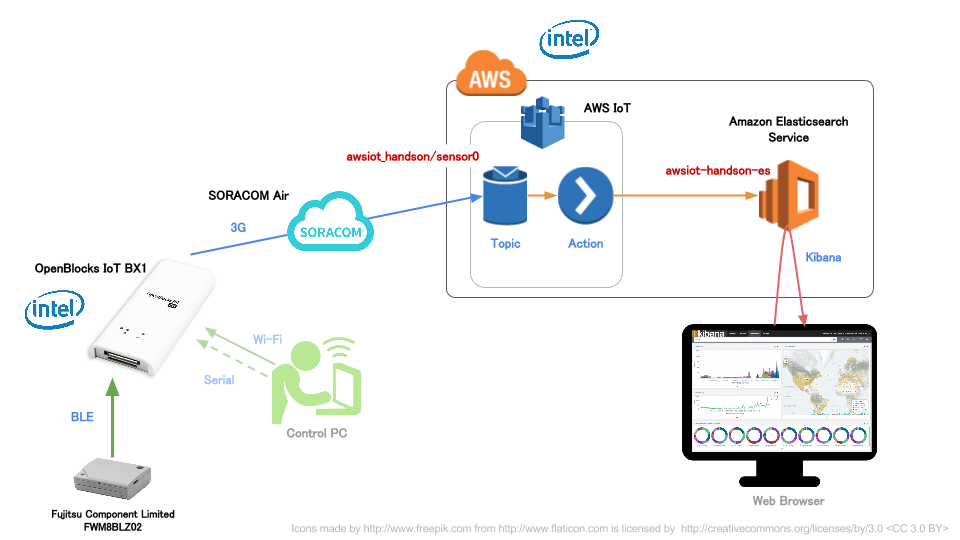

全体構成
========

OpenBlocks IoT BX1 (以下 BX1) を使用し、富士通コンポーネント社製 温度・加速度センサーデバイス "FWM8BLZ02" のデータを "SORACOM Air" の回線で "AWS IoT" に送信し、"Amazon Elasticsearch Service" (以下 Amazon ES)上のKibanaでグラフ化するところまでを解説します

全体構成図と流れは以下のようになります

※ `上図SVG <_static/bx1_00_overview.svg>`_

#. :doc:`01`
#. :doc:`02`
#. :doc:`03`
#. :doc:`04`
#. :doc:`05`
#. :doc:`06`
#. :doc:`07`
#. :doc:`08`

※テキストのPDFは `こちら(5.5MB P74) <_static/IoT-Hands-On-OpenBlocks-IoT-SORACOM-AWS.pdf>`_

ハンズオンの前に
================

対象者（前提条件・スキル等）
----------------------------

* AWS Management Consoleの基本的な操作がわかる
* シリアルコンソールとターミナル等による機器操作スキル (FTDIシリアルドライバのインストール等含む)
* AWS IoTの概要を理解している(AWS IoT ハンズオン ~基本編~」を参考にしますと、より実践的な内容を理解することが出来ます。)

AWSのアカウントをお持ちでない方は
---------------------------------

Amazon Web Servicesをご利用いただくために、事前のアカウント取得をお願いいたします

| アカウントの取得はこちら
| http://aws.amazon.com/jp/register-flow/

| アカウント取得はクレジットカードの番号入力が必要となります
| アカウントを取得しただけでは料金はかかりません

ソラコムのアカウント取得・SORACOM Airのアクティベートが済んでいない方は
-----------------------------------------------------------------------

SORACOM Airを使用するため、事前にSORACOMアカウントの取得並びにSIMのアクティベートを完了しておいていただく必要があります

| アカウントの取得とSIMのアクティベートはこちら
| https://dev.soracom.io/jp/start/console/

アクティベートにはクレジットカードの番号入力が必要となります (アカウント登録には必要ありません)

部材等の確認
------------

準備するものをご確認ください (不足している場合はチューターにお声がけください)

* 支給されるもの

  * 持ち帰りOK

    * SORACOM Air <miniSIMサイズ> x 1枚

  * 貸し出し物 (返却いただきます)

    * OpenBlocks IoT BX1 x 1ケ
    * BX1用 電源兼シリアルコンソール USBケーブル x 1本
    * センサーデバイス FWM8BLZ02 (電池入り) x 1ケ

* 用意いただくもの <必須>

  * ノートPC

    * Wi-Fi接続可
    * USBポート使用可 (Aタイプ1ポート以上)
    * FTDIシリアルドライバーインストール済
    * シリアルコンソール制御用ターミナルソフトインストール済 (e.g. TeraTerm, GNU screen)
    * curlやwgetなどHTTPコールが可能なツール
    * Chrome等のモダンブラウザ(Internet ExplorerはNGですのでご注意)

  * 参加者個人のAWSアカウント
  * 有効なクレジットカード (SORACOM Airのアクティベーションに使用)

* あると便利なもの

  * スマートフォン (本ドキュメントを参照しながらの作業)

.. note::

  curl等のツール類はBX1の中に入っていますので、それを利用することも可能です
  (ただしBX1から利用する場合は3G回線費用が別途かかる可能性が有ります。その他、EC2インスタンスを用意して、そちらで実施することも可能です)

注意事項
--------

* 章毎に達成状況を確認しながら進めていきますが、時間の都合上未達者がいても次に進む場合がありますのでご了承ください
* AWSやSORACOM等、ハンズオンで発生する費用については参加者の自己負担となります
* 不明な点はお気軽にチューターへご相談ください

ソラコムの料金詳細は `SORACOM Airのご利用料金 <https://soracom.jp/services/air/price/>`_ をご覧ください

SORACOM Airには無料分利用枠があり、本ハンズオンでは無料枠内で収まる程度の通信となる見込みですが、その限りではありませんのでご承知ください

:doc:`01` へ進む
