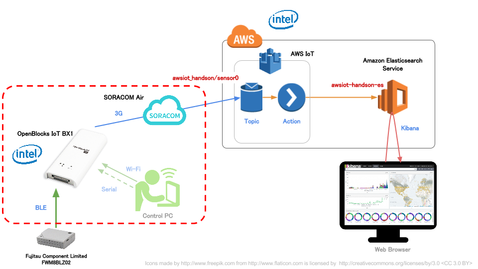
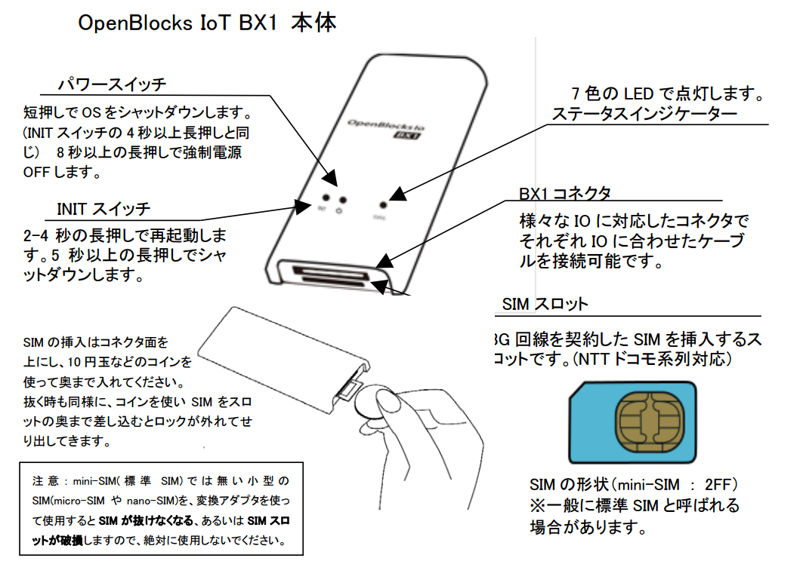
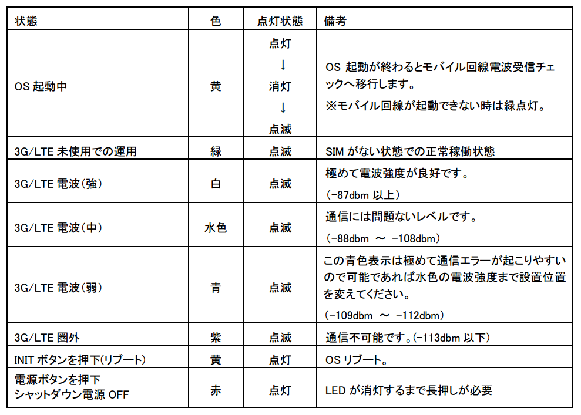
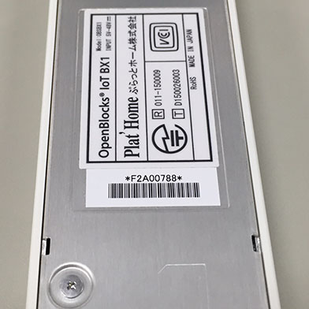
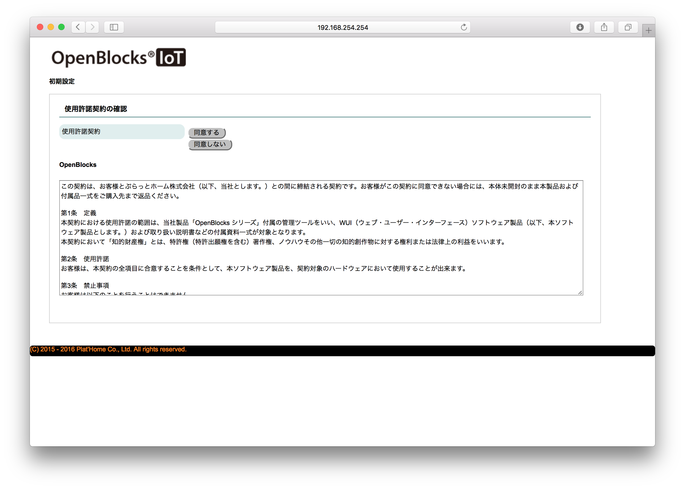
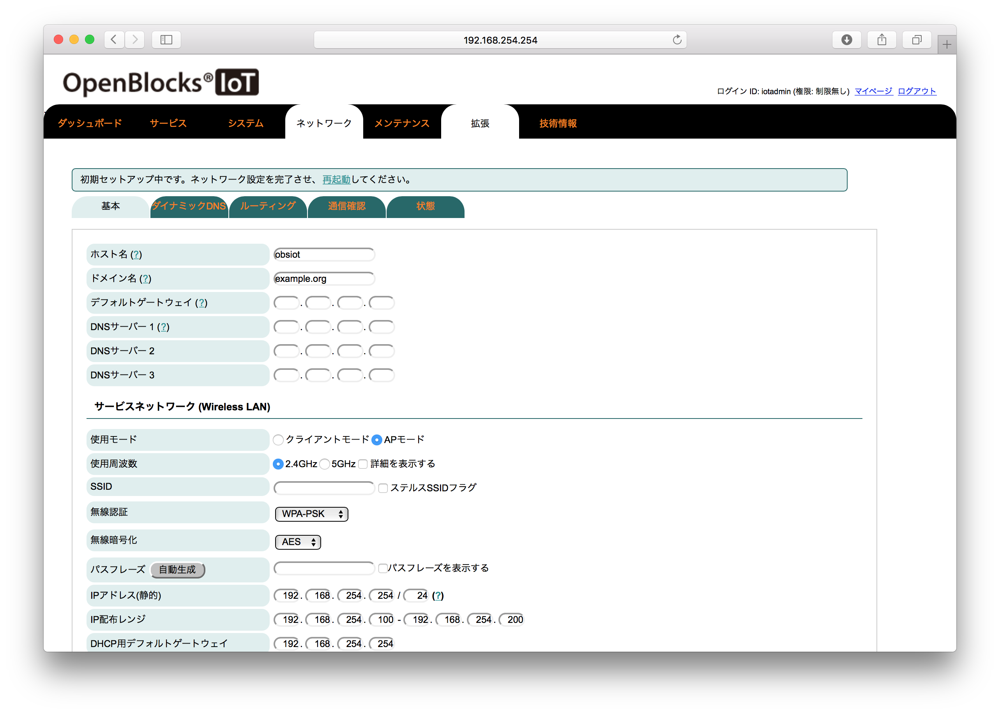
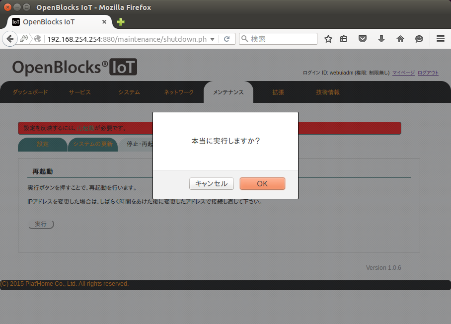
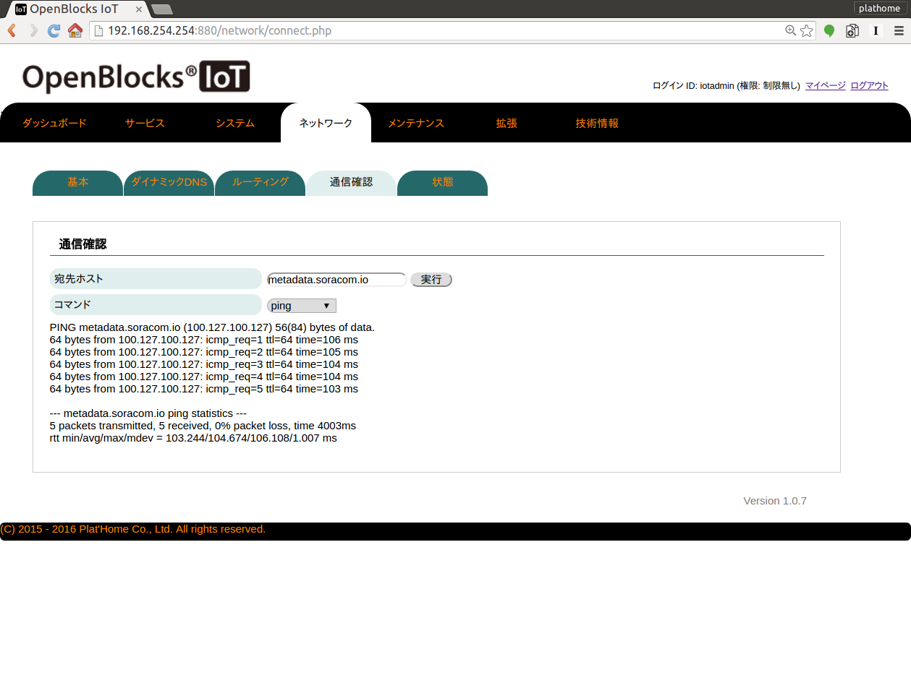
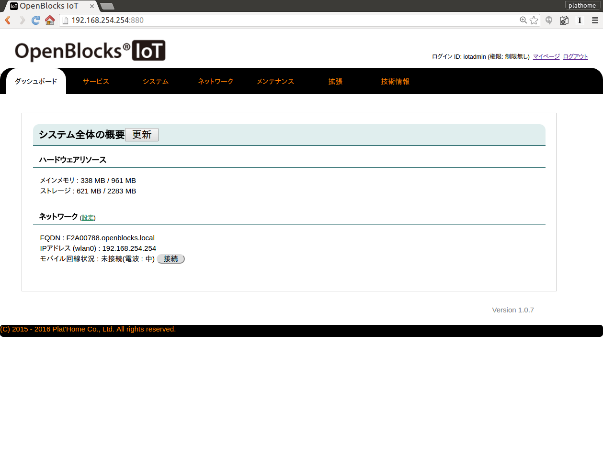

BX1のWi-Fi AP設定とSORACOM Air(3Gネットワーク)設定
==================================================

本章のゴール: **pingをWebUI上から行い、3G回線がつながっていることを確認する**

作業の位置づけ;



BX1の取り扱い (電源ON/OFF・再起動、SIM挿入)
-------------------------------------------

BX1は給電開始と共に電源ONとなります。USBケーブルを接続すると起動開始です

.. note::

  * INITボタンや電源ボタンはOSのシャットダウンと再起動に利用されますので、必要時以外は押さないでください
  * SIMは電源ON前に挿すようにしてください。起動後に挿しても認識しません

部位の名前やSIM挿入方法については、下記を参照してください



(`OpenBlocks IoT Family WEB UI セットアップガイド P7 <http://openblocks.plathome.co.jp/common/pdf/OpenBlocksIoTSeriseSetupGuide1_0_5.pdf#page=7>`_ より抜粋)

ステータスインジケータ (LEDの表示色)
------------------------------------

BX1は *STATUS* のLEDにて状態を把握することができます

本ハンズオンにおいては、起動後は **白色、水色、青色** が望ましく、それ以外の色の場合は不具合がある可能性がありますので、チューターにご相談ください

具体的なLED色と状態については、下記を参照してください



(`OpenBlocks IoT Family WEB UI セットアップガイド P7 <http://openblocks.plathome.co.jp/common/pdf/OpenBlocksIoTSeriseSetupGuide1_0_5.pdf#page=7>`_ より抜粋)

Web管理画面(WebUI)へのログイン
------------------------------

.. warning::

  * BX1に接続したPCやスマートフォンは、BX1のWi-Fiに接続している限り、後ほど設定するSORACOM Airの設定が終わるまではインターネットに接続することが出来ません
  * また、SORACOM Airの設定が完了すると、インターネットへのアクセスは "PC =[Wi-Fi]=> BX1 =[SORACOM Air]=> インターネット" という経路になり、 **通信料が発生する可能性があります** ので、Dropbox等の共有ソフトの動作をOFFにすることを **強く推奨いたします**

BX1とWi-Fiで接続する
````````````````````

BX1の起動が完了すると、BX1はWi-Fiのアクセスポイントとして動作を開始します

お手持ちのPCやスマートフォンから SSID を探し、接続してください

- SSID: ``iotfamily_BX1シリアル番号``
- Password: ``openblocks``

802.11g, WPA-PSK の設定で接続できます

お手持ちのBX1のシリアル番号確認方法
~~~~~~~~~~~~~~~~~~~~~~~~~~~~~~~~~~~

シリアル番号は、BX1のウラ面のバーコード上の文字と数字の組み合わせになります

下記例では **F2A00788** がシリアル番号です (そのためSSIDは **iotfamily_F2A00788** となります)



WebUIを表示する
---------------

BX1にWi-Fiで接続できたら、下記URLにてWebUIを表示します

http://192.168.254.254:880

下記の画面が出れば正常に接続ができています



使用許諾の確認と管理ユーザアカウントの設定
------------------------------------------

使用許諾の "同意する" ボタンを押すと、WebUI管理用アカウントの作成を求められます

下記にて設定願います (本来は複雑な組み合わせが好ましいのですが、ハンズオン時のトラブルシュート対策です)

+----------+----------------------------------------------+
| ID       | ``iotadmin``                                 |
+----------+----------------------------------------------+
| Password | ``0BSI0T`` (ゼロ ビー エス アイ ゼロ ティー) |
+----------+----------------------------------------------+

成功すると、ネットワーク設定画面が表示されます



Wi-Fi AP設定とSORACOM Air(3Gネットワーク)設定
---------------------------------------------

ネットワーク設定画面を開きます

(前項から正しく遷移していれば表示されているはずですが、そうでない場合は [ネットワーク] - [基本] を選択するようにしてください)

ネットワーク設定画面では各項目をそれぞれ下記のとおり設定してください

+---------------------------+--------------------------------------------------------------------------------+
| ホスト名                  | <シリアル番号> (例 F2A00788)                                                   |
+---------------------------+--------------------------------------------------------------------------------+
| ドメイン                  | ``openblocks.local``                                                           |
+---------------------------+--------------------------------------------------------------------------------+
| Wi-Fi / SSID              | iotfamily_<シリアル番号> (例: iotfamily_F2A00788)                              |
+---------------------------+--------------------------------------------------------------------------------+
| Wi-Fi / チャンネル        | <シリアル番号 最後の値> (例:F2A00788なら "8")  (0の方は10 / A~Eの方は 11)      |
+---------------------------+--------------------------------------------------------------------------------+
| Wi-Fi / パスワード        | ``openblocks``                                                                 |
+---------------------------+--------------------------------------------------------------------------------+
| モバイル回線 / APN        | ``soracom.io``                                                                 |
+---------------------------+--------------------------------------------------------------------------------+
| モバイル回線 / ユーザ名   | ``sora``                                                                       |
+---------------------------+--------------------------------------------------------------------------------+
| モバイル回線 / パスワード | ``sora``                                                                       |
+---------------------------+--------------------------------------------------------------------------------+

.. note::

  * Wi-Fiのチャンネル設定は **詳細を表示する** をチェックすることで表示されます
  * モバイル回線の設定は **サービスネットワーク(モバイル回線)** を **使用する** にチェックすることで表示されます

再起動
------

APNの設定は再起動で反映されるため、BX1を再起動します

#. WebUIから [メンテナンス] - [停止・再起動] を表示
#. 再起動を実施します (最後にに確認ダイアログがでるので見逃さないようにしてください)

.. note::

  再起動は5分程度かかります



pingで確認
----------

再起動が無事終了すればBX1は3Gネットワークに接続された状態となっています

WebUI上からpingを発信して確認してみます

#. WebUIにログインした後 [ネットワーク] - [通信確認]
#. 宛先ホスト: ``metadata.soracom.io``



ここまで到達できればゴールです

:doc:`02` へ進む

トラブルシュート
----------------

#. 当該SIMのアクティベーションは済んでいますか？
#. モバイル回線は接続できていますか？

モバイル回線の接続状況確認と接続方法
````````````````````````````````````

WebUIの "ダッシュボード" にてモバイル回線の接続状況確認と接続作業を行うことができます



