センサーとBX1の接続
===================

本章のゴール: **センサーデバイス FWM8BLZ02(以下、センサー)の温度データをBX1で受信し、WebUI上でグラフ化される**

作業の位置づけ;

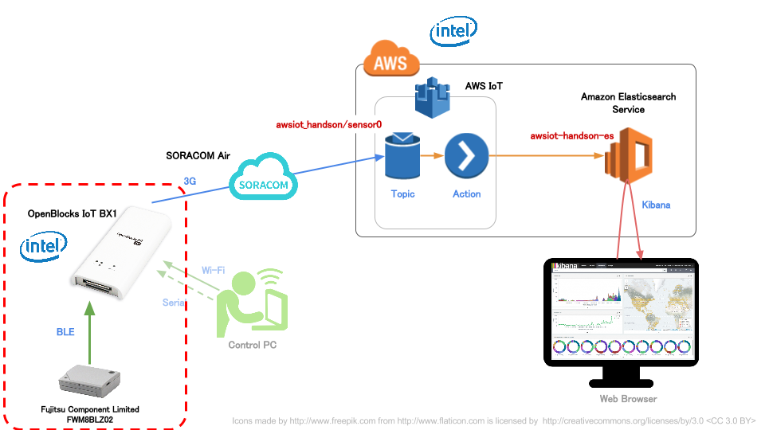

センサーをBX1に登録する
-----------------------

センサーの電源をONにする
````````````````````````

センサー側面の電源スイッチをONにしてください

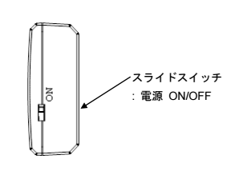

センサーの仕様
~~~~~~~~~~~~~~

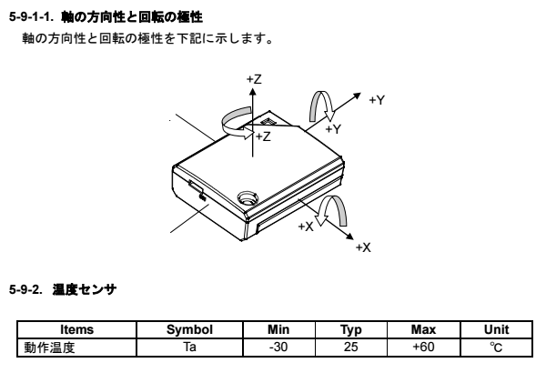

Bluetoothの使用を開始する
`````````````````````````

#. WebUIから [サービス] - [基本] を表示
#. *Bluetooth* の使用設定を **使用する** にして [保存]

.. image:: images/bx1_02_bluetooth-enable.png

センサーを検出して登録する
``````````````````````````

#. WebUIから [サービス] - [Bluetooth関連] を表示
#. **Bluetooth LEデバイス検出** の [検出] をクリック
#. 一覧の中から自分のデバイスを探し **使用設定** にチェックをして [保存]

.. note::

  * Bluetooth デバイス検出の方でなく **Bluetooth LEデバイス検出** を押すようにしてください

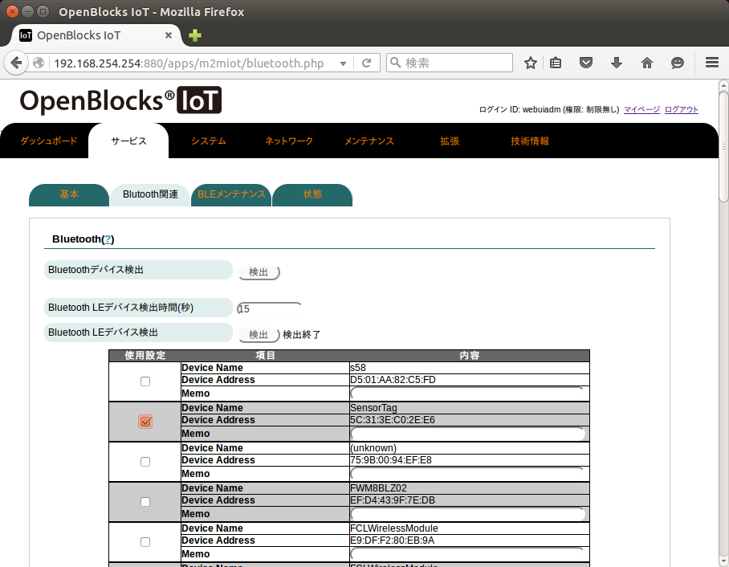

自分のデバイスの探し方
~~~~~~~~~~~~~~~~~~~~~~

Device Name = FWM8BLZ02 が大量に表示される可能性があります

お配りしたセンサーにはアドレスのタグが書かれており、画面上に表示されている *Device Address* (= MAC Address) と一致したものが、ご自分のセンサーとなりますので確認してください

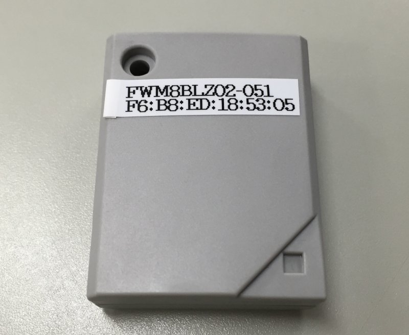

登録状況の確認
``````````````

保存すると WebUI は下記のようになります

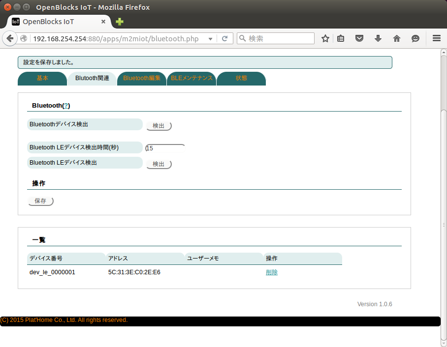

以上でセンサーをBX1に登録できました

BX1のデータ収集設定
-------------------

BX1のデータ収集機能を開始する
`````````````````````````````

#. WebUIから [サービス] - [基本] を表示
#. **データ収集** における **データ収集** ならびに **PD Handler** をそれぞれ **使用する** にして [保存]

.. note::

  * "PD Handler" は "データ収集" を <使用する> にすると表示されます

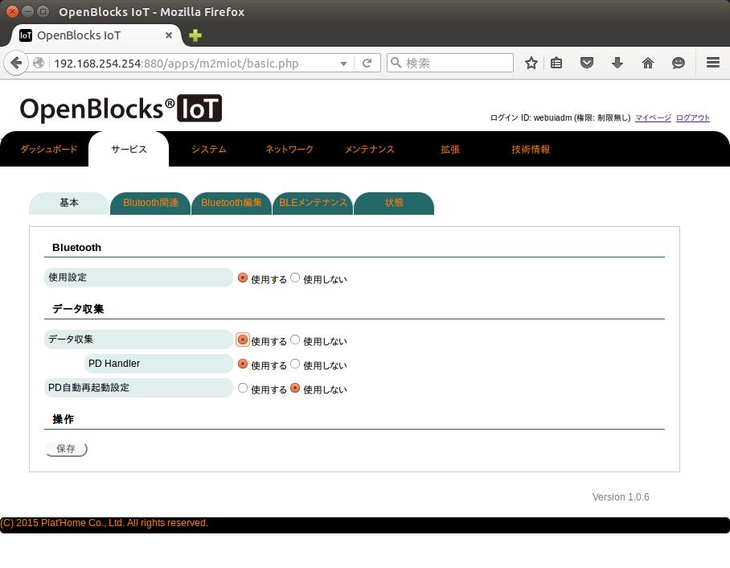

.. note::

  * データ収集を開始すると、新たにセンサーを登録をすることができなくなります
  * デバイス登録をする場合は、まず、データ収集を行わないように設定を変更してください。センサー登録を行いたい場合は、データ収集を停止することで登録が可能となります

BX1内へのデータ収集機能を開始する
`````````````````````````````````

#. WebUIから [サービス] - [収集設定] を表示
#. **本体内(local)** を **使用する**

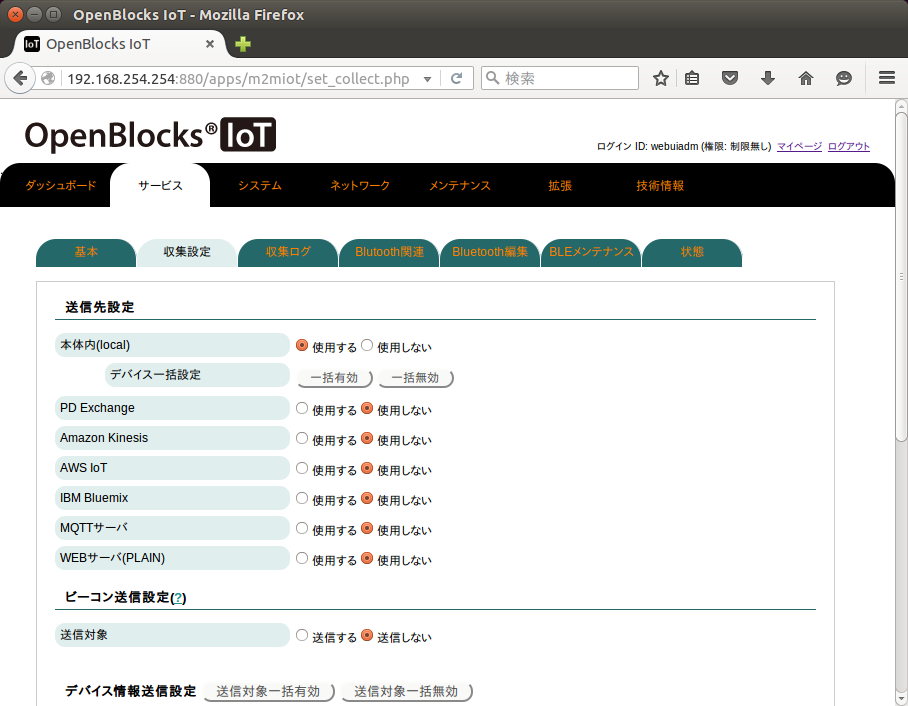

ページ後半に移動し **dev_le_0000001** の設定を下記のようにします

+------------------+---------------------+
| 送信対象         | 送信する            |
+------------------+---------------------+
| 取得時間間隔(ms) | ``1000``            |
+------------------+---------------------+
| 送信先設定       | localのみにチェック |
+------------------+---------------------+

以上を確認し [保存]

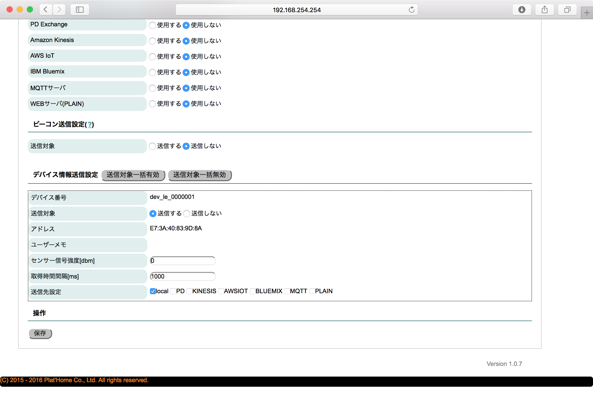

グラフの表示
````````````

localへのデータ収集が開始されると、WebUI内のグラフに表示が開始されます

[サービス] - [データ表示] にて確認できます

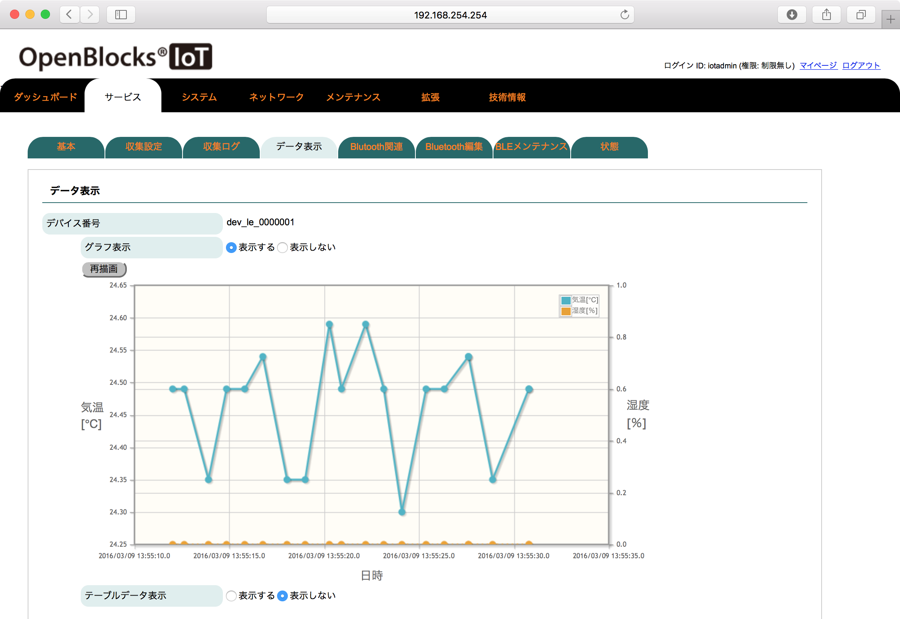

ここまで到達できればゴールです

:doc:`03` へ進む

トラブルシュート
----------------

データ収集状況ログの確認
````````````````````````

WebUIから [サービス] - [収集ログ] にて、動作確認が可能です

ログ選択はそれぞれ下記のとおりです

+-----------------------+-------------------------------------------------+
| pd-handler-stdout.log | センサー <-> BX1 間の送受信状況                 |
+-----------------------+-------------------------------------------------+
| pd-emitter.log        | BX1 <-> 送信先(localやAWS IoT等) 間の送受信状況 |
+-----------------------+-------------------------------------------------+

下記画面はセンサーからのデータ読み出しが成功している場合のログ画面です。JSONが表示されているのが見てわかります

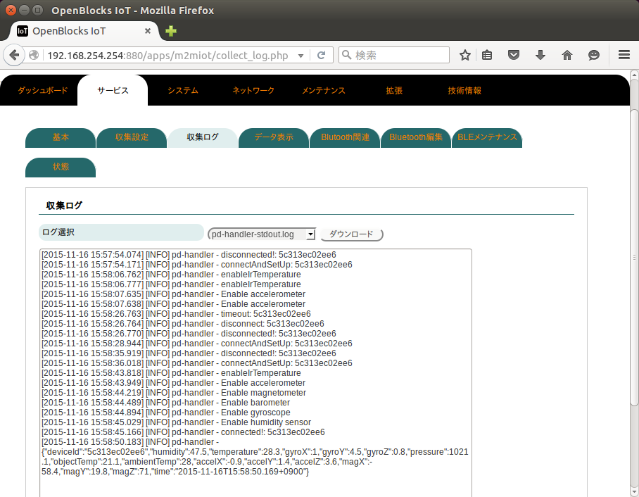

pd-handler-stdout.log に ``timeout: ...`` などと表示されている
``````````````````````````````````````````````````````````````

センサーとのBLE接続確立に失敗している可能性があります

#. しばらく待つ (再接続するため)
#. データ収集プロセスを再起動する (チューターにご相談ください)

これらで対処可能です

