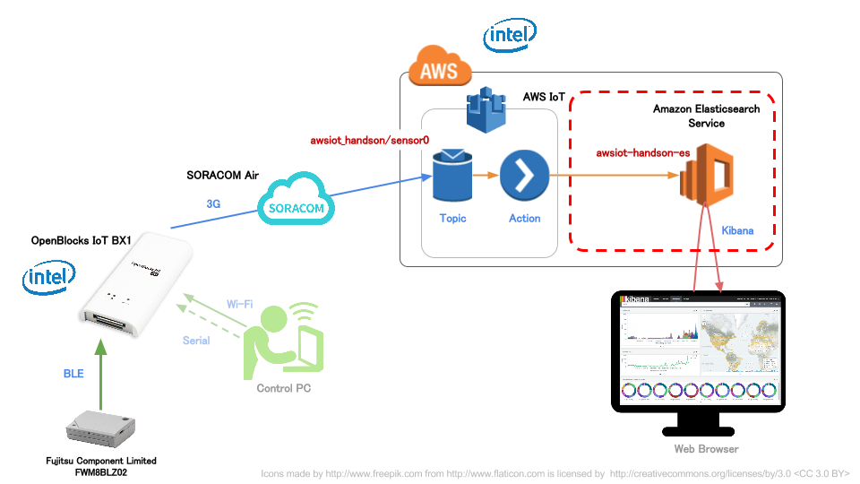
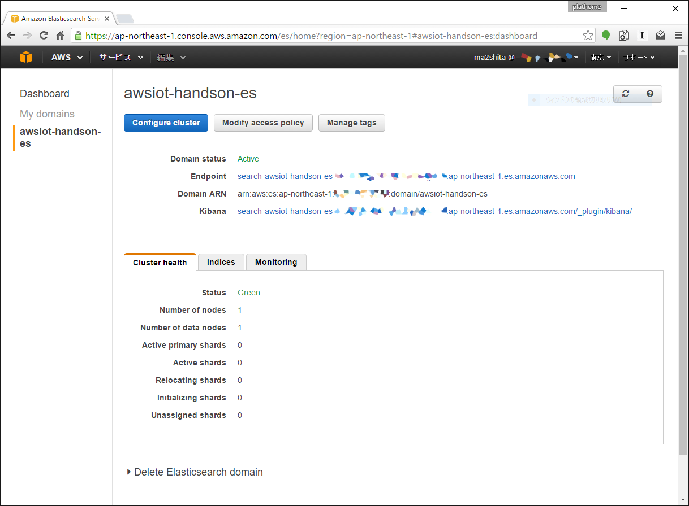
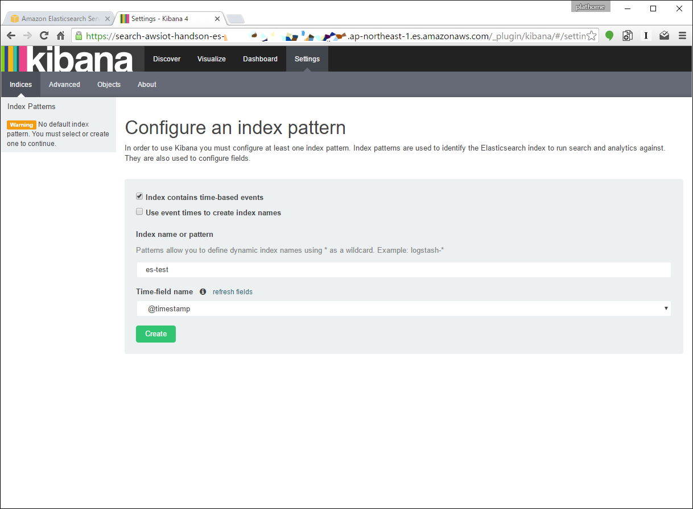
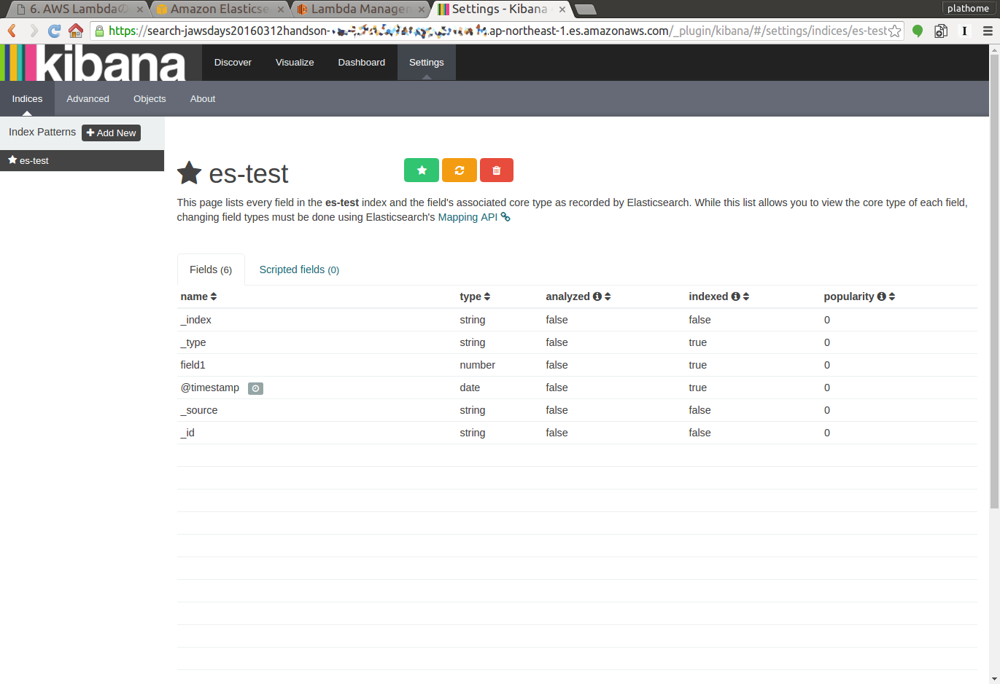
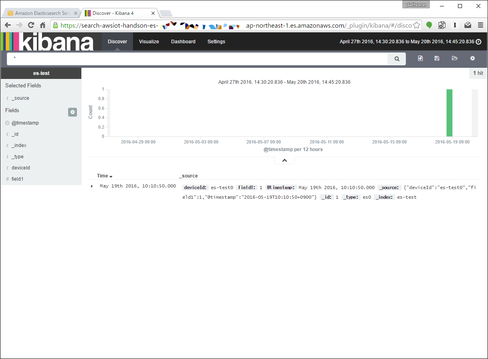
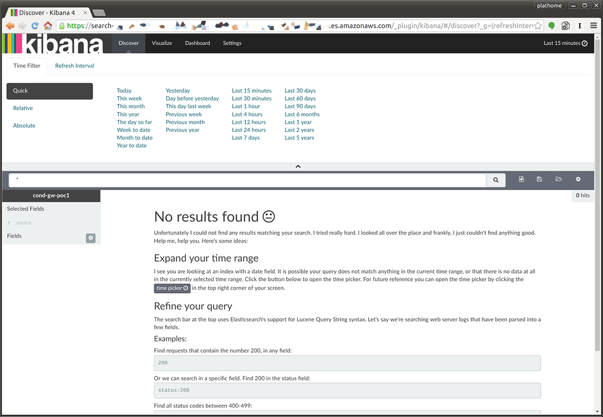

Amazon Elasticsearch Serviceのインスタンス作成と設定
====================================================

本章のゴール: **Amazon Elasticsearch Service上のKibanaでテストデータのグラフが表示される**

※以下、文中ではAmazon Elasticsearch Serviceを以下Amazon ESと略します

作業の位置づけ;



Amazon ESのクラスタを作成
-------------------------

Get started (もしくはダッシュボードの Create a new domain) からAmazon ESのインスタンス作成のウィザードを開始します

それぞれのステップでは、下記項目を変更するようにしてください (それ以外の項目はデフォルト値でOKです)

+---------------------------------+-----------------------------------------------+
|  Elasticsearch domain name      | ``awsiot-handson-es``                         |
+---------------------------------+-----------------------------------------------+
|  ＞ [Next] を押して次のステップへ                                               |
+---------------------------------+-----------------------------------------------+
|  Instance type                  | t2.micro.elasticsearch                        |
+---------------------------------+-----------------------------------------------+
|  Storage type                   | EBS                                           |
+---------------------------------+-----------------------------------------------+
|  ＞ [Next] を押して次のステップへ                                               |
+---------------------------------+-----------------------------------------------+
| Set the domain access policy to | Allow open access to the domain               |
+---------------------------------+-----------------------------------------------+
|  ＞ [Next] を押すと確認画面がでるので、確認後 [Confirm and create] で作成します |
+---------------------------------+-----------------------------------------------+

.. warning::

  今回は時間の関係上 "Allow open access to the domain" (=すべてのアクセスを許可) としています。本番運用時にはアクセスコントロールを行うようにしてください

.. note::

  Amazon ESが使えるようになるまで10分程度かかるため、次章の作業(:doc:`04`) を行うとよいでしょう

ElasticsearchのEndpointとKibanaのURLを確認する
----------------------------------------------

Amazon ESのダッシュボードからESのEndpointとKibanaのURLを確認します



テストデータの投入と表示
------------------------

Amazon ESが利用可能になったら、動作確認を行います

データの投入
````````````
.. note::

  * ここでは確認のために ``curl`` コマンドを使用します。準備願います (`Windowsの方向け <http://techblo.hatenablog.com/entry/2015/08/06/214306>`_)
  * ``date`` コマンドが下記の通り使えない場合は ``2016-05-19T10:10:50+0900`` というフォーマットの日付文字列に置き換えてください
  * ``${YOUR_ES_ENDPOINT}`` は、Amazon ESのダッシュボードで確認した Endpoint に置き換えてください

.. code-block:: console

    curl -X PUT ${YOUR_ES_ENDPOINT}/es-test/es0/1 -d "{\"deviceId\":\"es-test0\",\"field1\":1,\"@timestamp\":\"$(date +%Y-%m-%dT%H:%M:%S%z)\"}"

Windowsの方: 下記の通りダブルクオーテーションのエスケープを変更してください

.. code-block:: doscon

    curl -X PUT %YOUR_ES_ENDPOINT%/es-test/es0/1 -d "{""deviceId"":""es-test0"",""field1"":1,""@timestamp"":""2016-05-19T10:10:50+0900""}"

コマンドの投入結果は下記のようになります

.. code-block:: json

    {"_index":"es-test","_type":"es0","_id":"1","_version":1,"created":true}

Kibanaでの表示
``````````````

Indexを作成する
~~~~~~~~~~~~~~~

Amazon ESのダッシュボードで得た Kibana のURLにアクセスします

インデックスの設定を下記のとおりにします

+-----------------------+----------------+
| Index name or pattern | ``es-test``    |
+-----------------------+----------------+
| Time-field name       | @timestamp     |
+-----------------------+----------------+



テストデータが正しく投入されていれば "Create" ボタンが押せるようになるはずですので、押してください

下記の通り、インデックスのカラム一覧が表示されれば成功です

※そうでない場合、テストデータの投入に失敗している可能性があります。コマンドの実行結果等を確認してください



データを表示する
~~~~~~~~~~~~~~~~

"Discover" をクリックするとデータの中身を表示することができます



ここまで到達できればゴールです

:doc:`04` へ進む

トラブルシュート
----------------

テストデータの投入に失敗した(ようなので)インデックスを削除する
``````````````````````````````````````````````````````````````

.. code-block:: bash

  $ curl -X DELETE ${YOUR_ES_ENDPOINT}/es-test

データ投入に成功した(はず)が、ダッシュボードにデータが表示されない
``````````````````````````````````````````````````````````````````

データ表示期間の範囲が適切でない場合があります

右上の "Time Picker" のアイコンから "Time Filter" で、例えば "Last 30 Days" に設定してみてください


