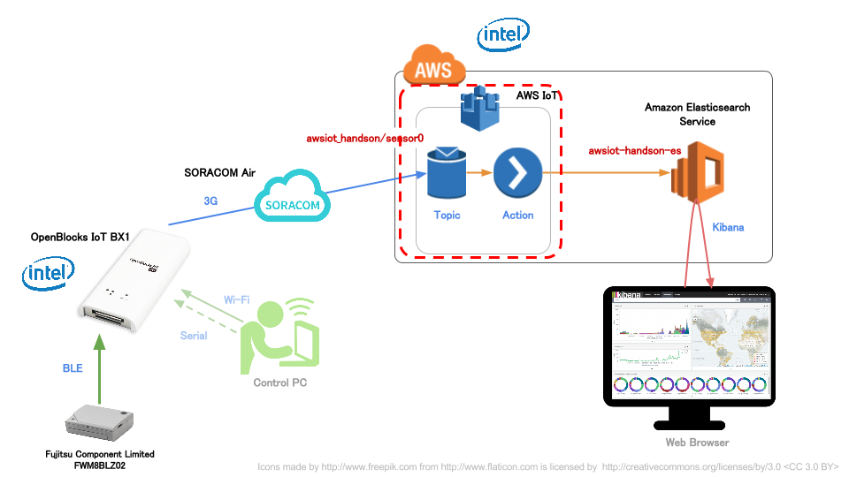
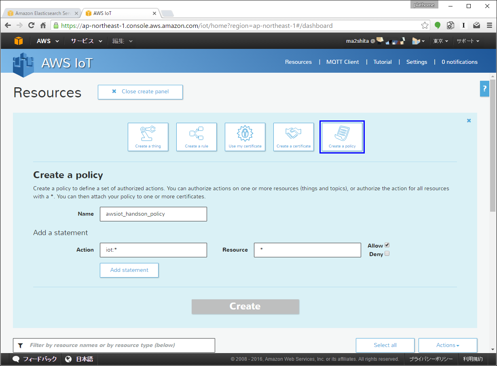
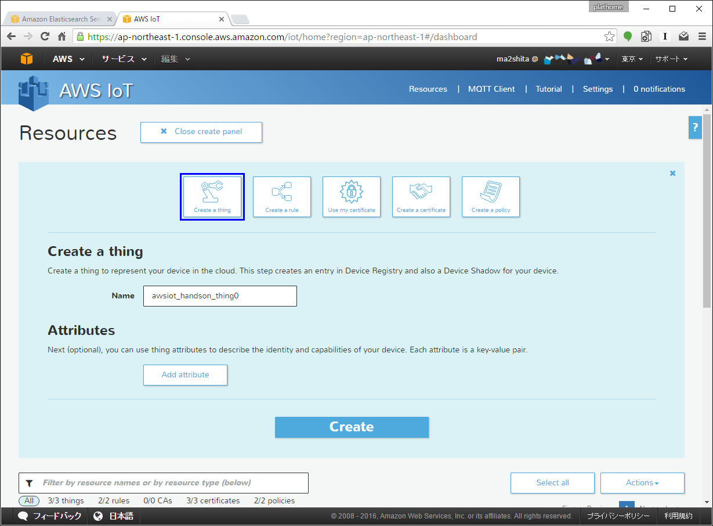
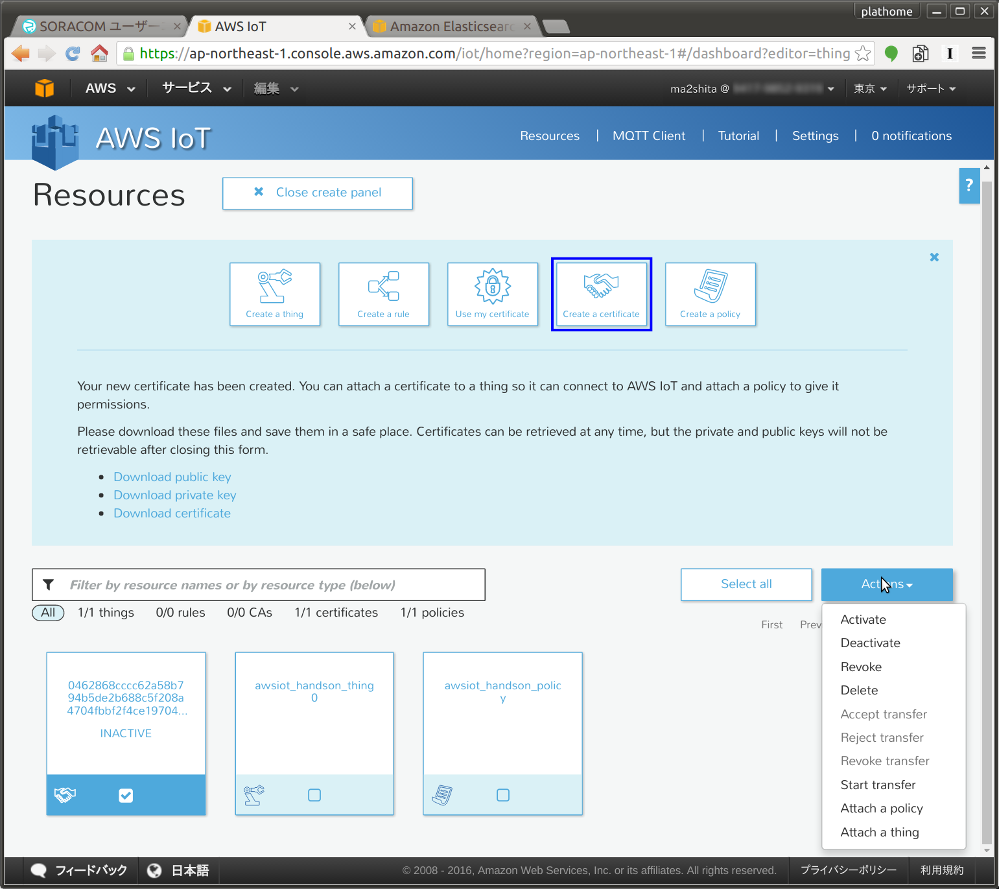
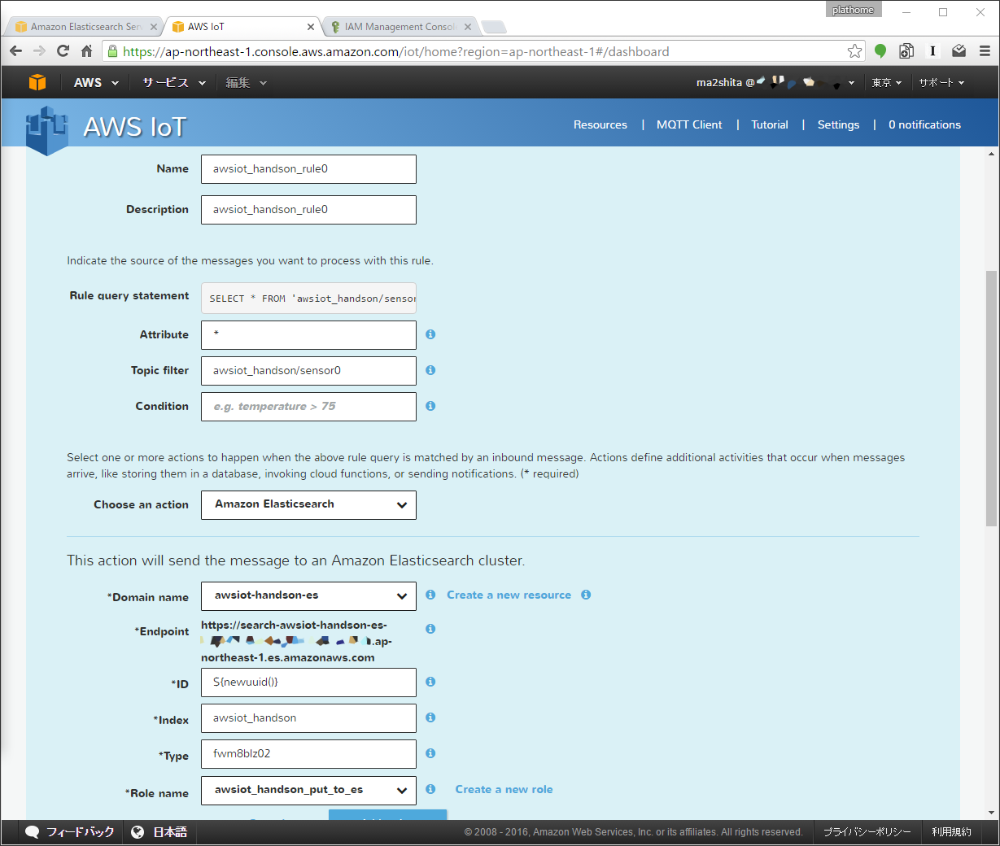
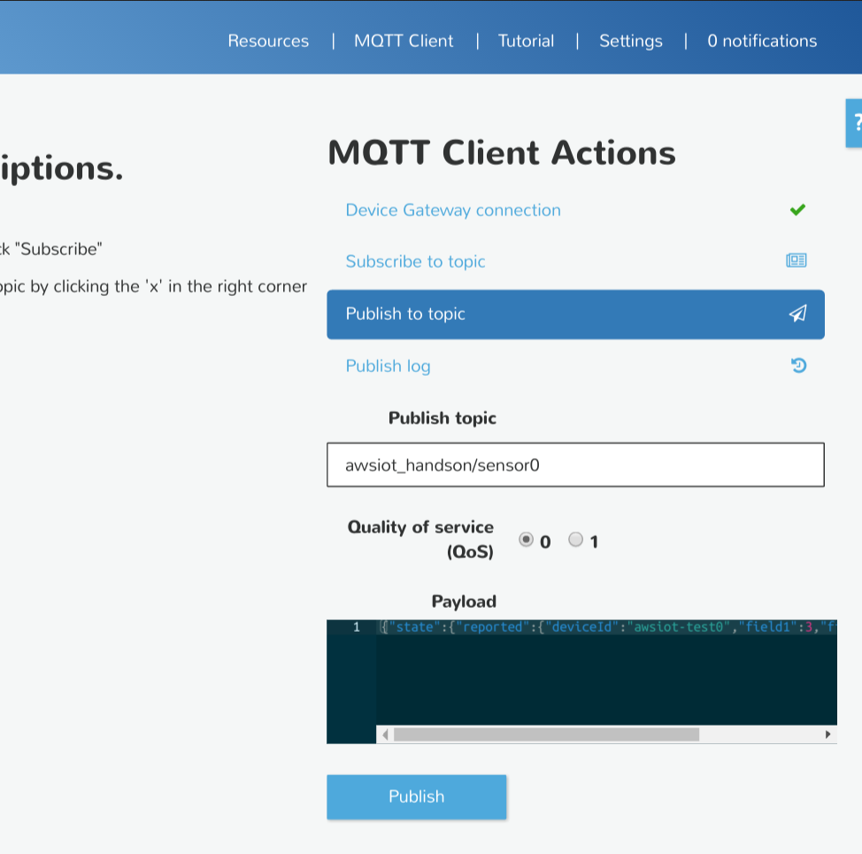
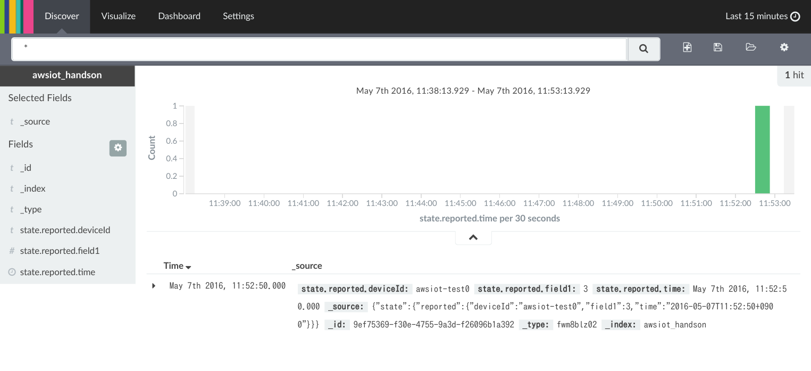
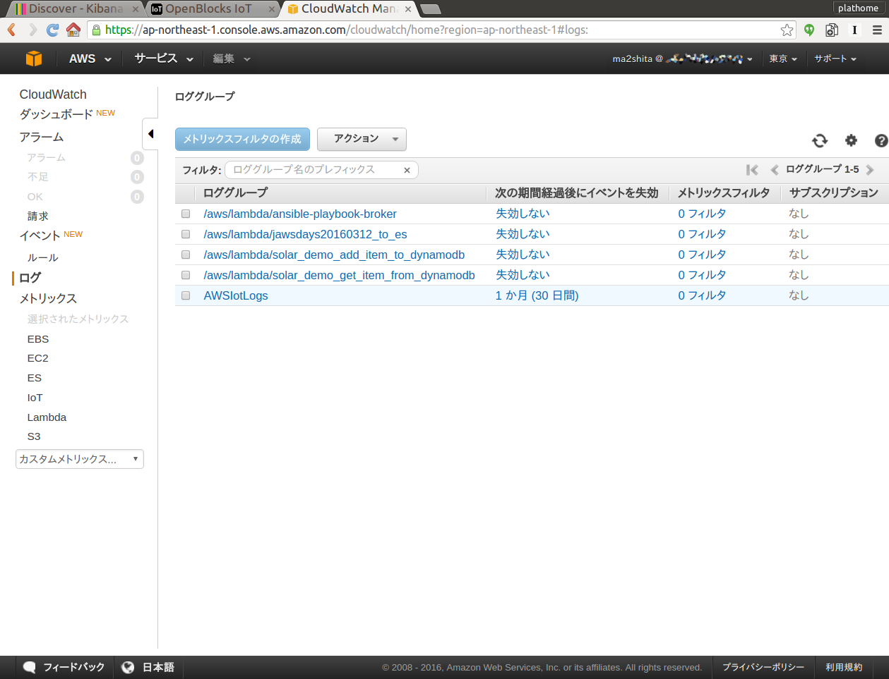

AWS IoTの設定
=============

本章のゴール: **AWS IoTでMQTT(AWS IoT上のテストサイト)による受信ができることを確認する**

作業の位置づけ;



概要
----

AWS IoTの設定は若干ステップが多いため、まずステップの概要を確認します

#. :ref:`create_role`
#. :ref:`awsiot_create_policy`
#. :ref:`awsiot_create_thing`
#. :ref:`awsiot_create_certificate_and_attach_any`
#. :ref:`awsiot_create_rule`

.. _create_role:

IAMロールの作成
---------------

AWS IoTのルールを作成する前に、AWS IoTからAmazon Elasticsearch Serviceへデータ送信をするための権限ロールを作成します

ロールの作成
````````````

IAMコンソールのロール一覧から [新しいロールの作成] をクリックし、ウィザードを開始します

ウィザードの各項目は下記のようにしてください

+--------------------+-----------------------------------------+
| ロール名           | ``awsiot_handson_put_to_es``            |
+--------------------+-----------------------------------------+
| ロールタイプの選択 | AWS サービスロール => **AWS IoT** を選択|
+--------------------+-----------------------------------------+
| ポリシーのアタッチ | <なにも選択せず>                        |
+--------------------+-----------------------------------------+

インラインポリシーの設定
````````````````````````

#. IAMコンソールのロール一覧から、先ほど作成した **awsiot_handson_put_to_es** ロールを選択
#. [インラインポリシー] - [ここをクリックしてください] をクリック
#. 次の画面では [カスタムポリシー] - [選択] をクリック
#. 下記の通りポリシー名とポリシードキュメントを設定し [ポリシーの検証] をした後 [ポリシーの適用] をクリック

+------------+-----------------------------------------------+
| ポリシー名 | ``awsiot_handson_put_to_es_adhoc_policy``     |
+------------+-----------------------------------------------+

ポリシードキュメント

※ *AWS_ACCOUNT_ID* は各自のAWS AccountIDに読み替えるようにしてください

.. code-block:: json

    {
        "Version": "2012-10-17",
        "Statement": {
            "Effect": "Allow",
            "Action": "es:ESHttpPut",
            "Resource": [
                "arn:aws:es:ap-northeast-1:AWS_ACCOUNT_ID:domain:awsiot-handson-es/*"
            ]
        }
    }

以上でロールの作成は完了です **_**

.. _awsiot_create_policy:

AWS IoTポリシの作成
-------------------

"モノ" が AWS IoTにアクセスする際の制限を設定することができます

今回はフルコントロールとします

.. note::

  IAMのポリシーとは別のものになります

作業
````

#. AWS IoTのコンソールから "Create a resource" をクリックし "Create a policy" をクリック
#. 下記を入力したら "Add statement" をクリックし "Create" をクリック

+----------+--------------------------------------------------+
| Name     | ``awsiot_handson_policy``                        |
+----------+--------------------------------------------------+
| Action   | ``iot:*``                                        |
+----------+--------------------------------------------------+
| Resource | テキストボックスに ``*`` を入力、Allowにチェック |
+----------+--------------------------------------------------+

これでポリシが作成されました

※下図は "Add statement" 直前の画面です



.. _awsiot_create_thing:

"モノ" の作成
-------------

AWS IoT上で "モノ" として認識できるようにします

実物の "モノ" の状態を管理するための機能であるThing shadowを使用する際に、特に必要となります

作業
````
#. AWS IoTのコンソールから "Create a thing" をクリック
#. 下記を入力したら "Create" をクリック

+----------+----------------------------------------------+
| Name     | ``awsiot_handson_thing0``                    |
+----------+----------------------------------------------+

これで "モノ" が作成されました

※下図は "Create" 直前の画面です




.. _awsiot_create_certificate_and_attach_any:

証明書の作成, ポリシの割り当て, "モノ"の割り当て
------------------------------------------------

"モノ" がAWS IoTにアクセスする際に使用する証明書(キーペア)を作成します

"モノ" に公開鍵を持たせてAWS IoTにアクセスすることで認証としています

証明書は有効(活動中)/無効(非活動)というステータスを持っており、証明書が有効だとしても非活動の場合はAWS IoTへのアクセスができないといった制御が可能です

また、この証明書にポリシと "モノ" を割り当てることで、その証明書を持っている "モノ" の制限をすることができるという仕組みです

すでに存在するキーペアから作成することも可能ですが、今回はAWS IoTに発行してもらいます

.. note::

  AWS IoT接続トラブルの原因の80%が、証明書に起因するものですので丁寧に実施してください

作業
````

* 証明書の作成

  #. AWS IoTのコンソールから "Create a certiicate" をクリック
  #. "1-CLick certificate create" をクリック <"INACTIVE" と書かれた証明書が作成されます>
  #. 画面上の "Download private key" と "Download certificate" をクリックし、それぞれ .pem.key ファイルと .pem.crt ファイルを取得する

.. warning::

  * private keyファイルはこのタイミングでのみダウンロード可能です。あとでダウンロードできないので、必ず取得してください

* ポリシを証明書に割り当て

  #. 作成された証明書のチェックボックスをクリック (ついていれば次へ)
  #. [Actions]の中から[Attach a policy]をクリック
  #. Policy name にポリシ名 ``awsiot_handson_policy`` を入力し "Attach" をクリック

* "モノ" を証明書に割り当て

  #. 証明書のチェックボックスをクリック (ついていれば次へ)
  #. [Actions]の中から[Attach a thing]をクリック
  #. Thing name にポリシ名 ``awsiot_handson_thing0`` を入力し "Attach" をクリック

* 証明書のアクティベート

  #. 証明書のチェックボックスをクリック (ついていれば次へ)
  #. [Actions]の中から[Activate]をクリック <証明書が "ACTIVE" に変化します>

※下図は 証明書にチェックを入れた後 "Actions" をクリックした直後の画面です



.. _awsiot_create_rule:

ルールの作成
------------

AWS IoTでは、MQTTやRESTで送信されてきたデータに対して、どのようにアクションするか設定でき、これをルールと呼びます

作業
````

#. AWS IoTのコンソールから "Create a rule" をクリック
#. 下記を入力したら "Add action" をクリックし "Create" をクリック

+-------------------+-------------------------------+
| Name              | ``awsiot_handson_rule0``      |
+-------------------+-------------------------------+
| Description       | ``awsiot_handson_rule0``      |
+-------------------+-------------------------------+
| SQL version       | 2016-03-23-beta               |
+-------------------+-------------------------------+
| Attribute         | ``*``                         |
+-------------------+-------------------------------+
| Topic filter      | ``awsiot_handson/sensor0``    |
+-------------------+-------------------------------+
| Condition         | <なにも入力しません>          |
+-------------------+-------------------------------+
| Choosen an action | Amazon Elasticsearch Service  |
+-------------------+-------------------------------+
| Domain name       | awsiot-handson-es             |
+-------------------+-------------------------------+
| ID                | ``${newuuid()}``              |
+-------------------+-------------------------------+
| Index             | ``awsiot_handson``            |
+-------------------+-------------------------------+
| Type              | ``fwm8blz02``                 |
+-------------------+-------------------------------+
| Role              | awsiot_handson_put_to_es      |
+-------------------+-------------------------------+

これでルールが作成されました

※下図は "Add action" 直前の画面です



.. note::

  Amazon Elasticsearch Serviceのインスタンスが完了してない場合は Endpointが *https://null* となり、設定が完了できません。Amazon ESのインスタンス作成の完了を待ってからルール作成を行ってください

AWS IoT上のMQTTクライアントツールを使用した確認
-----------------------------------------------

AWS IoTにはMQTTクライアントツールがあり、それを使って簡単に動作確認をすることができます

作業
````

#. AWS IoTコンソールの右上 "MQTT Client" をクリック
#. "Generate client ID" をクリック <Client IDに任意の文字列が入ります>
#. "Connect" をクリック
#. "Publish to topic" をクリック
#. 下記を入力して "Publish" をクリック

+---------------+-----------------------------------------------------------------------------------------------------+
| Publish topic | ``awsiot_handson/sensor0``                                                                          |
+---------------+-----------------------------------------------------------------------------------------------------+
| Payload       | ``{"state":{"reported":{"deviceId":"awsiot-test0","field1":3,"time":"2016-05-19T10:10:50+0900"}}}`` |
+---------------+-----------------------------------------------------------------------------------------------------+



Kibana上に上記payloadのデータが入っていれば成功です

.. note::

  :doc:`03` では **es-test** というIndexにデータを入れましたが、この章で使用しているIndexは **awsiot_handson** です

  Kibanaの **Settings** 画面から新規に **awsiot_handson** を基にIndexを作成するようにしてください



ここまで到達できればゴールです

:doc:`05` へ進む

.. _awsiot_ts:

トラブルシュート
----------------

AWS IoTのログ
`````````````

CloudWatchで確認することができます



CertificateファイルやPrivate keyファイルのダウンロードを忘れた
``````````````````````````````````````````````````````````````

AWS IoT上で証明書を作成しなおしてください

また、ファイルを失ってしまった証明書は削除してください

AWS IoTの証明書が削除できない
`````````````````````````````

証明書を削除できる条件は 1.モノやポリシが割り当てられていない 2.Deactivate状態である この２つが満たされている必要があります

割り当て済みのポリシや "モノ"を解除する

#. 証明書をクリック
#. 右側に現れたウィンドウの [Detail] で モノやポリシを "dettach" します

Deactivate状態にする

#. 証明書のチェックボックスをクリック (ついていれば次へ)
#. [Actions]の中から[Deactivate]をクリック <証明書が "INACTIVE" に変化します>

Rule作成時に Elasticsearch Service のインスタンスが見つからない
```````````````````````````````````````````````````````````````

リージョンを確認してください

AWS IoTとElasticsearch Serviceのリージョンは一致している必要があります

Kibanaにデータが表示されない
````````````````````````````

表示対象のIndexが **es-test** になっていませんか？
