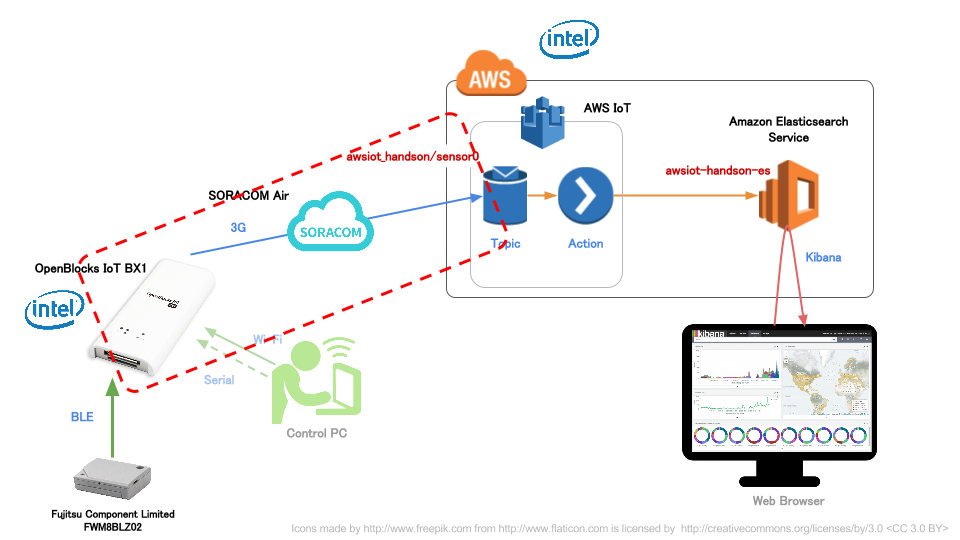
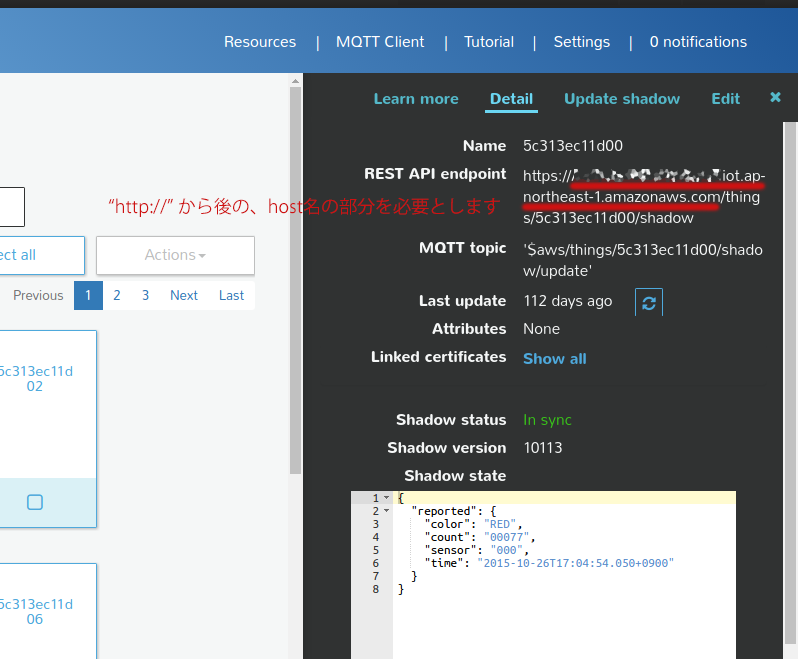
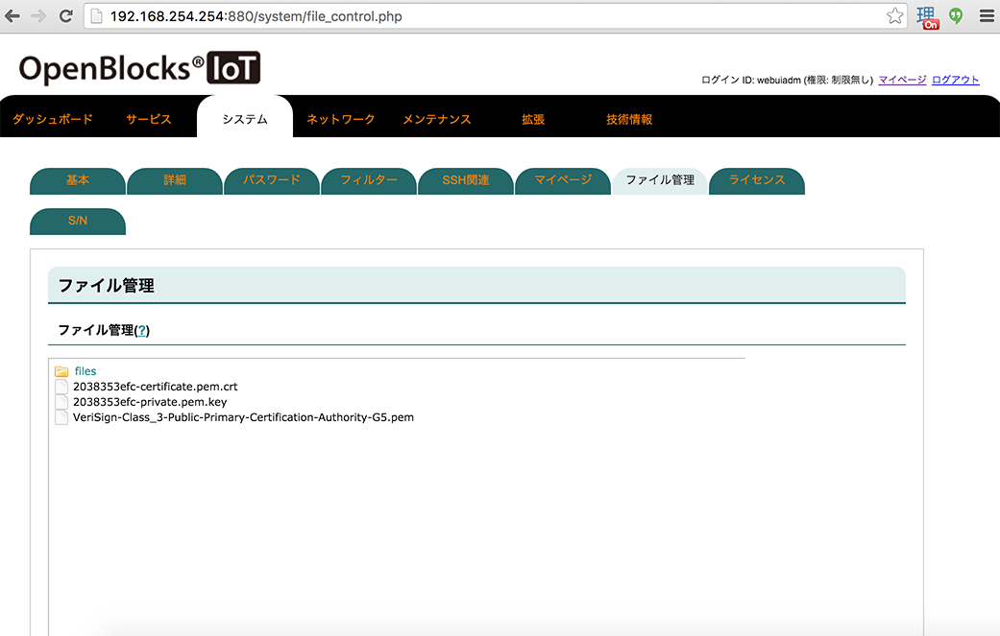
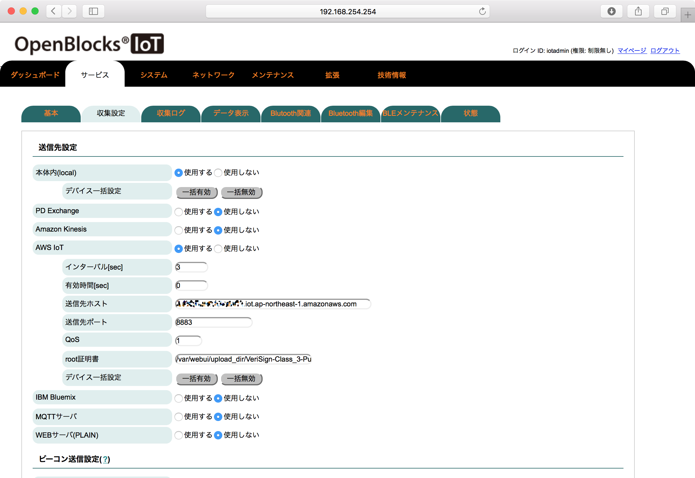
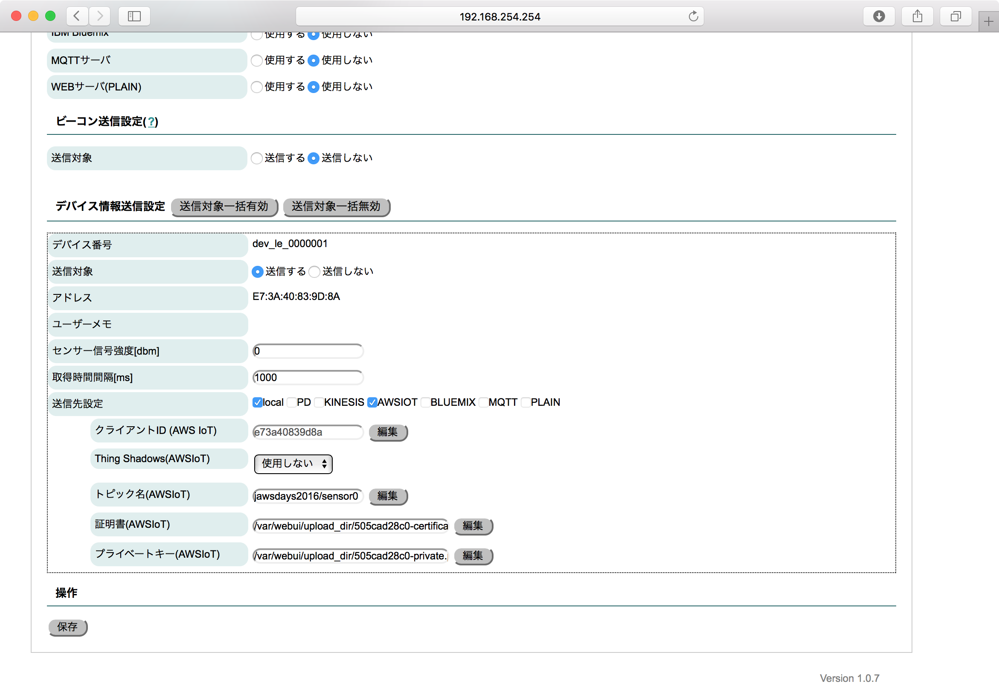
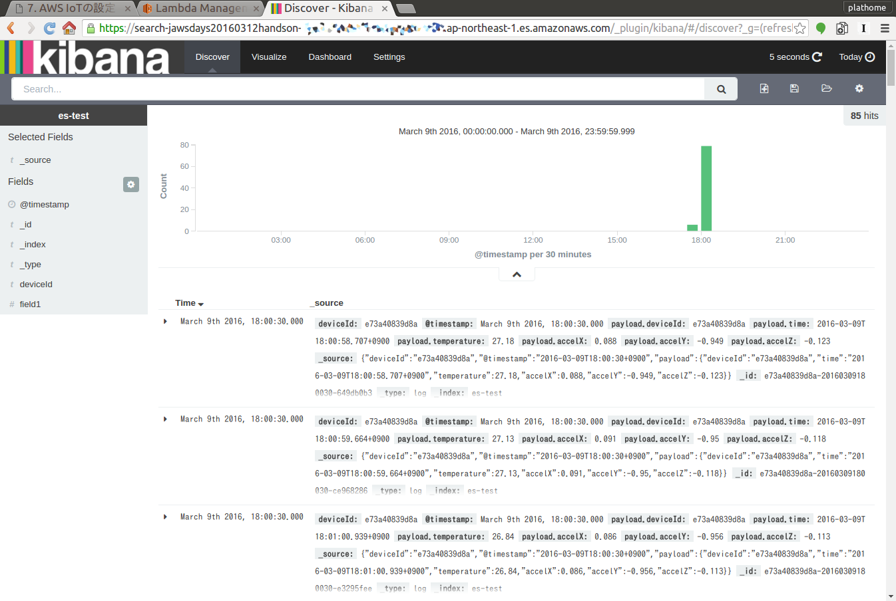
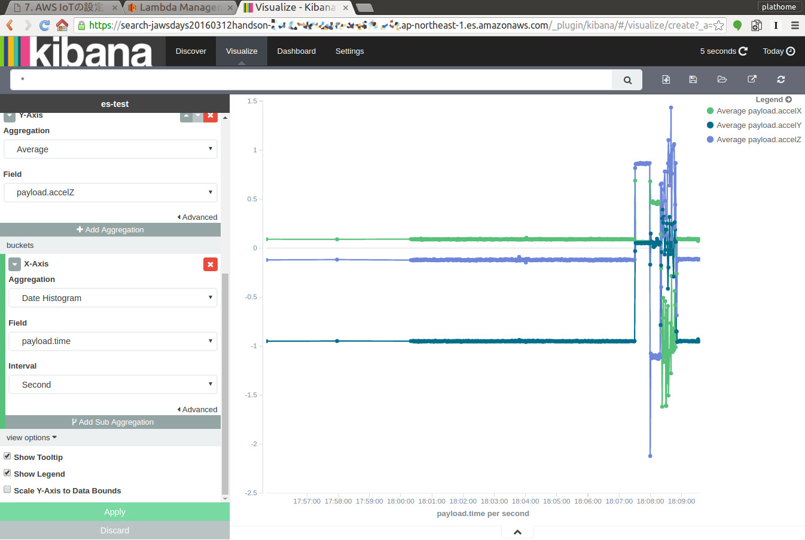

BX1とAWS IoTの接続
==================

本章のゴール: **センサーからのデータがAWS IoTとAWS Lambdaを通じてAmazon ES上のKibana上で確認できる**

作業の位置づけ;



準備
----

AWS IoTから入手しておくもの
```````````````````````````

* 証明書(Certificate)ファイル <拡張子 .pem.crt>
* プライベートキー(PrivateKey)ファイル <拡張子 .pem.key>
* エンドポイント

エンドポイントの確認方法
~~~~~~~~~~~~~~~~~~~~~~~~

最終的には "XXXXXXX.iot.REGION.amazonaws.com" というフォーマットの文字列を入手します

下記どちらかの方法で確認してください

- AWS CLIで ``aws iot describe-endpoint`` で確認
- AWS IoTコンソールの "Things" の REST API endpointから抜き出す



その他、入手しておくもの
````````````````````````

- `ルート証明書ファイル <https://www.symantec.com/content/en/us/enterprise/verisign/roots/VeriSign-Class%203-Public-Primary-Certification-Authority-G5.pem>`_

.. warning::

  * 上記URLにはファイル名にスペースが含まれています。しかしBX1ではファイル名にスペース文字が使用できないため、処置をしておいてください (本ハンズオンではスペースを ``_`` に変更しています)

BX1設定
-------

ファイルアップロード
````````````````````

AWS IoTの証明書ファイル・プライベートキーファイル・ルート証明書ファイルの3つをBX1にアップロードします

#. WebUIから [システム] - [ファイル管理] を表示
#. 本画面からファイルを3つ、それぞれアップロード

すべてアップロードされると、下記のような画面となります



収集設定 / AWS IoTに対する設定
``````````````````````````````

#. WebUIから [サービス] - [収集設定] を表示
#. **AWS IoT** を **使用する** (クリックで設定が展開します)
#. 下記の通り設定します

+--------------+------------------------------------------------------------------------------------------+
| インターバル | ``3``                                                                                    |
+--------------+------------------------------------------------------------------------------------------+
| 送信先ホスト | <エンドポイントURL>                                                                      |
+--------------+------------------------------------------------------------------------------------------+
| root証明書   | ``/var/webui/upload_dir/VeriSign-Class_3-Public-Primary-Certification-Authority-G5.pem`` |
+--------------+------------------------------------------------------------------------------------------+

.. note::

  * 先のファイルアップロード画面でアップロードされたファイルは BX1内の ``/var/webui/upload_dir/`` にアップロードされます。それ以下のパスを指定することでファイルの読み込みが可能です



保存せず、引き続きページ下部へ移動します

収集設定 / センサーのデータ送信先にAWS IoTを加える
``````````````````````````````````````````````````

#. dev_le_0000001 の **送信先設定** で **AWSIOT** にチェックを付けます (クリックで設定が展開します)
#. 下記の通り設定します

+---------------------------+---------------------------------------------------------------+
| トピック名                | ``awsiot_handson/sensor0``                                    |
+---------------------------+---------------------------------------------------------------+
| 証明書(AWS IoT)           | ``/var/webui/upload_dir/<アップロードした .pem.crtファイル>`` |
+---------------------------+---------------------------------------------------------------+
| プライベートキー(AWS IoT) | ``/var/webui/upload_dir/<アップロードした .pem.keyファイル>`` |
+---------------------------+---------------------------------------------------------------+



保存後、即座にAWS IoTへの送信が始まります。Amazon ESのKibanaでデータ受信ができているか確認してください



データの変化を楽しむ
--------------------

加速度をつかってこんなグラフを作ることできます

※Kibanaの使い方は本ハンズオンの範疇を超えてしまうため、興味のある方はチューターにお声がけください



センサーのデータ取得間隔が1秒毎となっているため、加速度の数値を変化させたい場合は若干振り続ける等するようにしてください

くれぐれも降ってる最中に投げ出す事のないように、ご注意願います！

お疲れ様でした！
----------------

無事ハンズオンのゴール達成です！

**あとかたづけ作業をお忘れなく！**

:doc:`06` へ進む

トラブルシュート
----------------

以下を確認してみてください

1. センサーからのデータを受信できているか (pd-handler-stdout.logを確認してください)
2. 3G通信ができているか (pingを試してみてください)
3. AWS IoTへ接続・送信できているか (CloudWatchを確認してください)

  - AWS IoTのエンドポイントはあっているか
  - トピック名はあっているか
  - 証明書があっているか

    - 証明書はACTIVEになっているか
    - 有効なポリシがアタッチされているか

  - ルールは正しくLambdaを呼び出すようになっているか

4. AWS Lambdaを呼び出せているか (CloudWatchを確認してください)

  - 有効なロールがセットされているか
  - Elasticsearch Serviceのエンドポイントはあっているか


BX1からAWS IoTへの送信状況の確認
````````````````````````````````

WebUIから [サービス] - [収集ログ] にて、動作確認が可能です

ログ選択はそれぞれ下記のとおりです

+-----------------------+-------------------------------------------------+
| pd-handler-stdout.log | センサー <-> BX1 間の送受信状況                 |
+-----------------------+-------------------------------------------------+
| pd-emitter.log        | BX1 <-> 送信先(localやAWS IoT等) 間の送受信状況 |
+-----------------------+-------------------------------------------------+

