自習室: SORACOM BeamでAWS IoTの認証処理をオフロード
===================================================

本章のゴール: **BX1の設定をAWS IoTからMQTTに切り替えてもAWS IoTならびにAmazon ESへのデータ送信がされる**

作業の位置づけ;

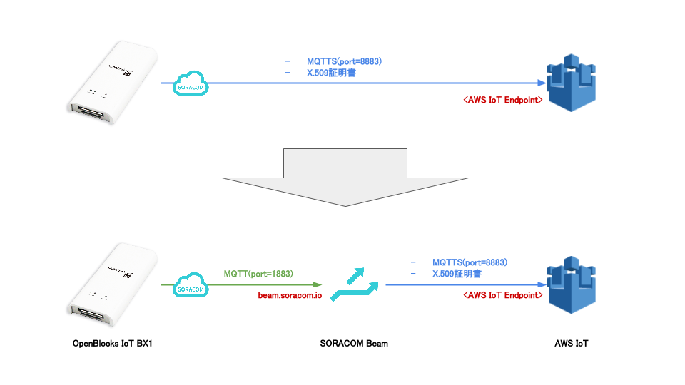

SORACOM Beamとは？
------------------

IoT デバイスにかかる暗号化等の高負荷処理や接続先の設定といった面倒な処理を、クラウドにオフロードできるサービスです

Beamでサポートしている機能は下記のとおりです (2016年5月現在)

- プロトコル変換 (証明書添付含む)
- 接続先切り替え

詳細は `SORACOM Beamのページ <https://soracom.jp/services/beam/>`_ をご覧ください

自習室で行うこと
----------------

:doc:`05` では、AWS IoTに接続するために必要な証明書(ファイル3つ)をBX1に格納していました

この証明書をBX1からSORACOMへ移動し、SORACOM Beamを使ってAWS IoTに接続します

前提条件
````````

すでにハンズオンすべてを完了させており、センサーデータがAmazon Elasticsearch Serviceの Kibana上で確認できることが必要です

BX1の仕様上の注意点
```````````````````

SORACOM Beamへの切り替えに先立って、BX1の仕様上の注意を確認します

#. AWS IoT向けとMQTTサーバ向けでデータのpayloadフォーマットが違います。詳細は :ref:`sensordata` をご覧ください
#. MQTTサーバ向けの送信先トピックは **<トピックプレフィックス>/<ユニークID(MQTT)>** と、ユニークIDが自動的に付与されます

作業手順
--------

#. :ref:`stop_sending_to_awsiot`
#. :ref:`add_rule_in_awsiot`
#. :ref:`add_cert`
#. :ref:`create_sim_group_and_config_beam`
#. :ref:`join_group`
#. :ref:`sending_beam`

.. _stop_sending_to_awsiot:

BX1: AWS IoTへの送信を停止
--------------------------

AWS IoTへの送信を停止します

#. WebUIから [サービス] - [収集設定] を表示
#. **AWS IoT** を **使用しない** に変更
#. [保存] をクリック

保存するとAWS IoTへの送信を即時停止します (BX1内のグラフ描画は継続されます)

Kibana上にも送信されていないことを確認してください

.. note::

  **デバイス情報送信設定** の **送信先設定** には AWS IoTの設定情報が残っていますが、使用されません

.. _add_rule_in_awsiot:

AWS: AWS IoTにルールを追加する
------------------------------

AWS IoTにルールを追加します

BX1固有の注意点にも記載したとおり、MQTTの送信先トピックが ``awsiot_handson/sensors/<ユニークID(MQTT)>`` となったため、これを受けられるAWS IoTのルールを新設します

ルールの作成の仕方は :ref:`awsiot_create_rule` を参照してください

+-------------------+-------------------------------+
| **Name**          | ``awsiot_handson_rule1``      |
+-------------------+-------------------------------+
| **Description**   | ``awsiot_handson_rule1``      |
+-------------------+-------------------------------+
| SQL version       | 2016-03-23-beta               |
+-------------------+-------------------------------+
| Attribute         | ``*``                         |
+-------------------+-------------------------------+
| **Topic filter**  | ``awsiot_handson/sensors/#``  |
+-------------------+-------------------------------+
| Condition         | <なにも入力しません>          |
+-------------------+-------------------------------+
| Choosen an action | Amazon Elasticsearch Service  |
+-------------------+-------------------------------+
| Domain name       | ``awsiot-handson-es``         |
+-------------------+-------------------------------+
| ID                | ``${newuuid()}``              |
+-------------------+-------------------------------+
| **Index**         | ``awsiot_handson_w_beam``     |
+-------------------+-------------------------------+
| Type              | ``fwm8blz02``                 |
+-------------------+-------------------------------+
| Role              | awsiot_handson_to_es_role     |
+-------------------+-------------------------------+

※ :ref:`awsiot_create_rule` と違う部分を特に強調してあります

.. _add_cert:

SORACOM: 証明書ストアへX.509証明書の登録
----------------------------------------

ソラコムのコンソールから [セキュリティ] - [認証情報ストア] - [認証情報を登録] を順にクリック

各項目は下記のようにしてください

+---------------+-----------------------------------------------------------------------------------------------------------------------------------------------------------------------------------------------------------------------+
| 認証情報ID    | ``AWSIoT_cert_0``                                                                                                                                                                                                     |
+---------------+-----------------------------------------------------------------------------------------------------------------------------------------------------------------------------------------------------------------------+
| 概要          | ``AWSIoT cert 0``                                                                                                                                                                                                     |
+---------------+-----------------------------------------------------------------------------------------------------------------------------------------------------------------------------------------------------------------------+
| 種別          | X.509 証明書                                                                                                                                                                                                          |
+---------------+-----------------------------------------------------------------------------------------------------------------------------------------------------------------------------------------------------------------------+
| 秘密鍵 (key)  | ``<CertID>-private.pem.key`` の中身をペースト                                                                                                                                                                         |
+---------------+-----------------------------------------------------------------------------------------------------------------------------------------------------------------------------------------------------------------------+
| 証明書 (cert) | ``<CertID>-certificate.pem.crt`` の中身をペースト                                                                                                                                                                     |
+---------------+-----------------------------------------------------------------------------------------------------------------------------------------------------------------------------------------------------------------------+
| CA証明局      | `VeriSign-Class 3-Public-Primary-Certification-Authority-G5.pem <http://www.symantec.com/content/en/us/enterprise/verisign/roots/VeriSign-Class%203-Public-Primary-Certification-Authority-G5.pem>`_ の中身をペースト |
+---------------+-----------------------------------------------------------------------------------------------------------------------------------------------------------------------------------------------------------------------+

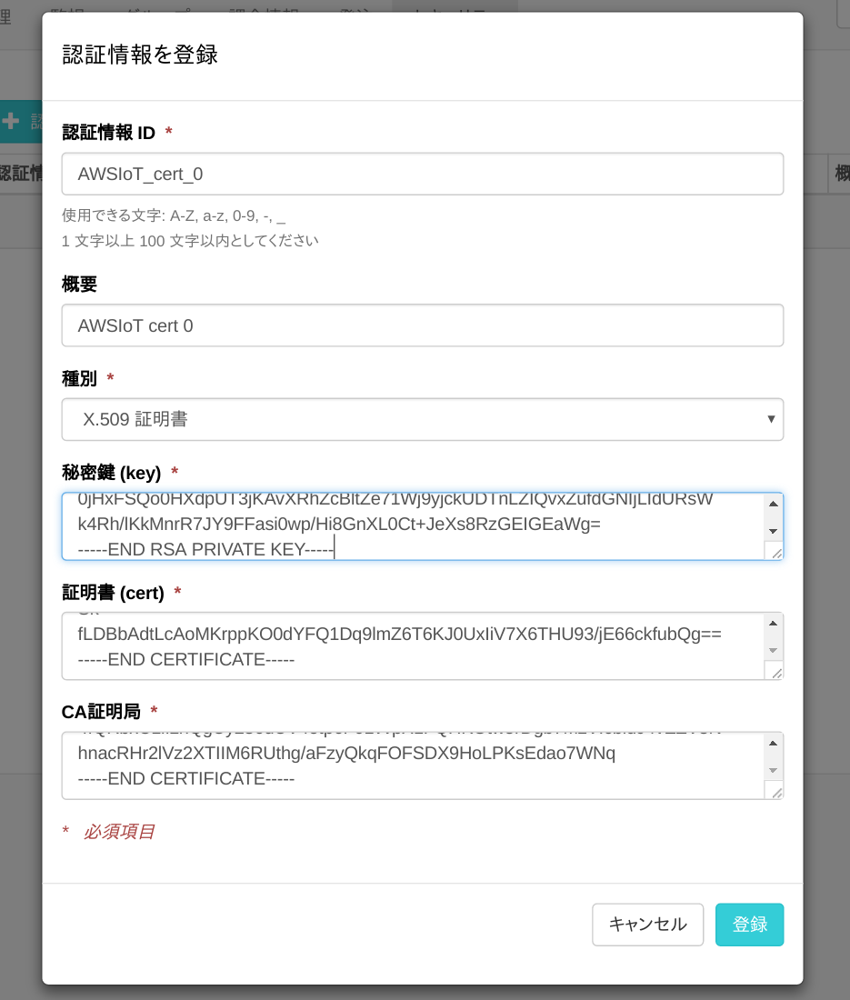

設定を確認したら [登録] をクリック

無事登録されると認証情報ストアに下図のように表示されます

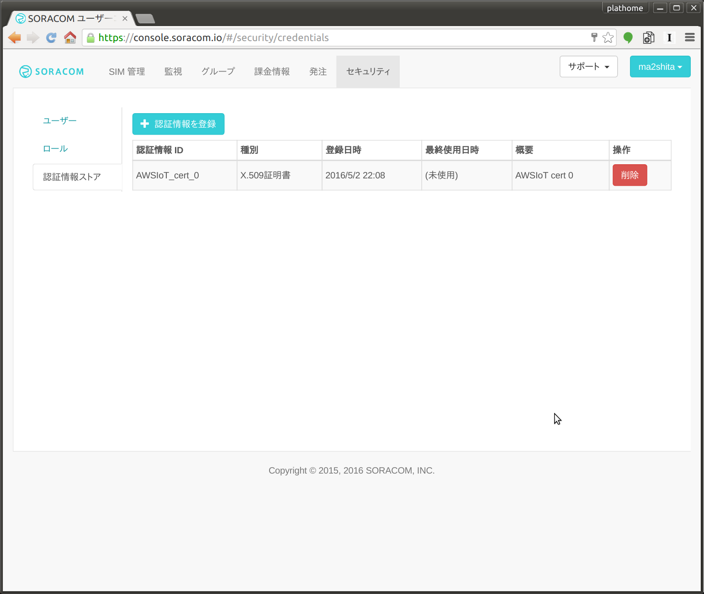

.. note::

  認証情報ストアには複数の認証情報を格納することができるほか、内容の編集・削除も可能です

.. _create_sim_group_and_config_beam:

SORACOM: SIMグループの作成とBeamの設定
--------------------------------------

SIMグループの作成
`````````````````

ソラコムのコンソールから [グループ] - [追加] を順にクリック

各項目は下記のようにしてください

+------------+-----------------+
| グループ名 | ``mqtt2awsiot`` |
+------------+-----------------+

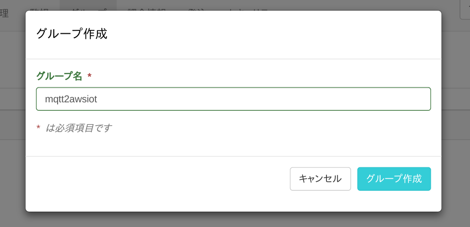

設定を確認したら [グループ作成] をクリック

SORACOM Beamの設定
``````````````````

ソラコムのコンソールから [グループ] - [mqtt2awsiot] - [SORACOM Beam 設定] を順にクリック

[＋] をクリックし、リストの中から [MQTT エントリポイント] をクリック

各項目は下記のようにしてください

+------------------------------+-------------------------------+
| 設定名                       | ``AWS IoT``                   |
+------------------------------+-------------------------------+
| 転送先 / プロトコル          | MQTTS                         |
+------------------------------+-------------------------------+
| 転送先 / ホスト名            | <AWS IoT エンドポイント>      |
+------------------------------+-------------------------------+
| 転送先 / ポート番号          | ``8883``                      |
+------------------------------+-------------------------------+
| 転送先 / ユーザ名            | <空>                          |
+------------------------------+-------------------------------+
| 転送先 / パスワード          | <空>                          |
+------------------------------+-------------------------------+
| 転送先 / 証明書              | ON                            |
+------------------------------+-------------------------------+
| 転送先 / 証明書タイプ        | AWSIoT_cert_0 (AWSIoT cert 0) |
+------------------------------+-------------------------------+

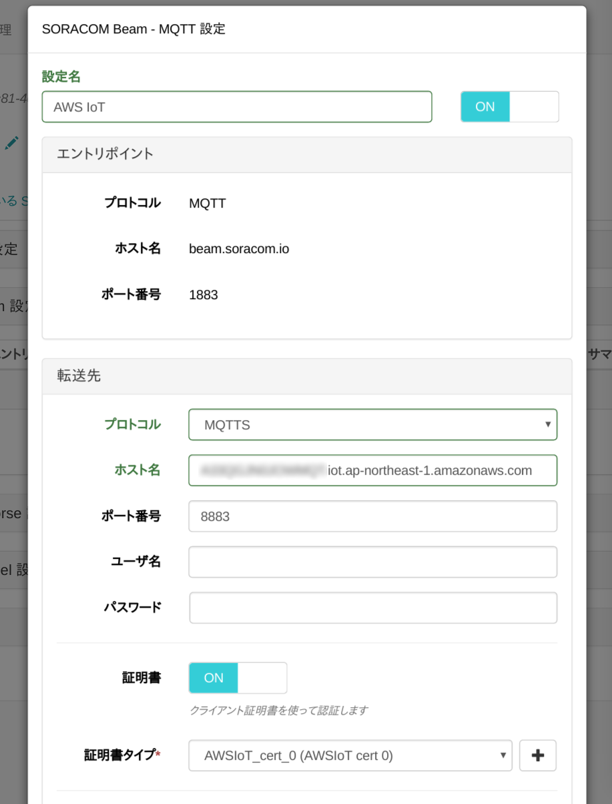

設定を確認したら [保存] をクリック

無事登録されると下図のように表示されます

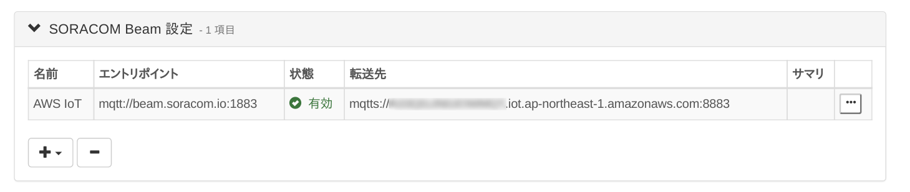

.. _join_group:

SORACOM: SIMをグループに所属させる
----------------------------------

ソラコムのコンソールから [SIM管理] をクリック

さきほど作成した **mqtt2awsiot** グループへ所属させたいSIMのチェックボックスをつけたあと、 [操作] - [所属グループ変更] をクリック

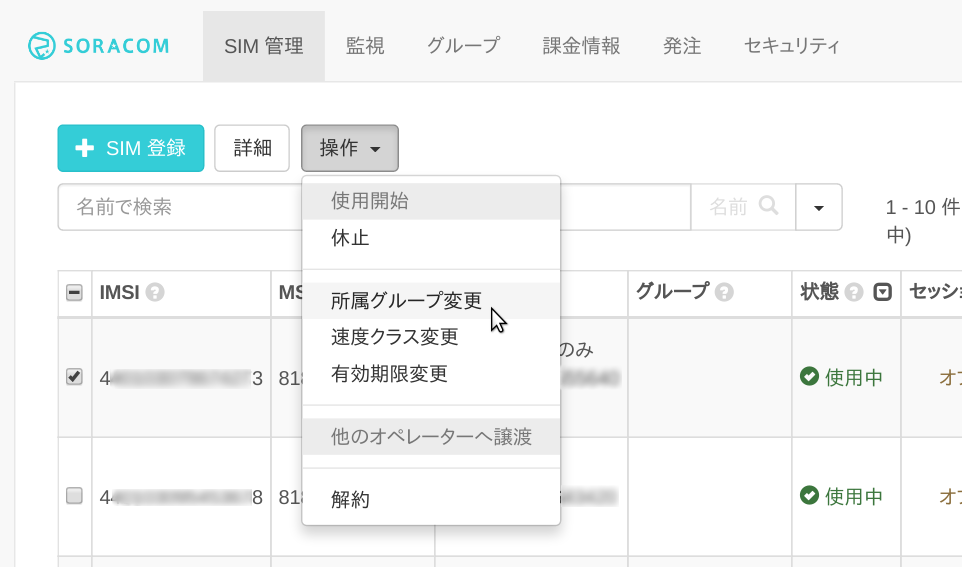

グループ変更画面で **mqtt2awsiot** を選択し [グループ変更] をクリック

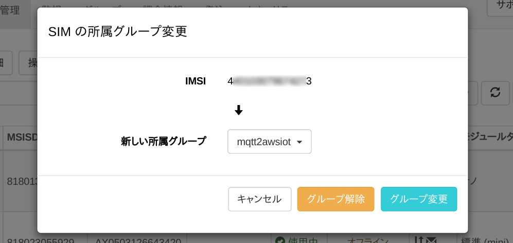

無事変更されると下図のように表示されます

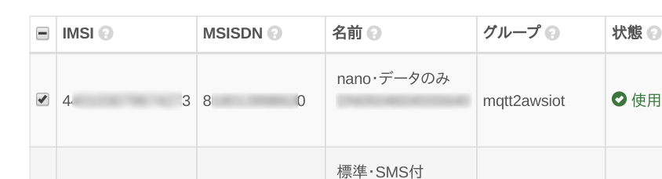

以上の操作で対象のSIMから **beam.soracom.io** へのMQTT通信は、AWS IoTへ X.509証明書によるMQTTS通信として転送されるようになりました

.. _sending_beam:

BX1: データをSORACOM Beam(MQTT)へ送信
-------------------------------------

これまでのハンズオンではBX1はAWS IoTへ直接MQTTS通信していたので、それを *beam.soracom.io* へMQTT通信するように切り替えます

収集設定 / AWS IoTのOFFとMQTTサーバへの設定
```````````````````````````````````````````

BX1のWebUIから [サービス] - [収集設定] を表示

下記の通りにします

#. **MQTTサーバ** を [使用する] に変更し、下記の通り設定します

+------------------------+----------------------------+
| インターバル[sec]      | ``2``                      |
+------------------------+----------------------------+
| 送信ホスト             | ``beam.soracom.io``        |
+------------------------+----------------------------+
| 送信先ポート           | ``1883``                   |
+------------------------+----------------------------+
| QoS                    | ``1``                      |
+------------------------+----------------------------+
| クライアントID         | ``bx1-mqtt-client0``       |
+------------------------+----------------------------+
| トピックプレフィックス | ``awsiot_handson/sensors`` |
+------------------------+----------------------------+
| ユーザ名               | <空>                       |
+------------------------+----------------------------+
| パスワード             | <空>                       |
+------------------------+----------------------------+
| プロトコル             | TCP                        |
+------------------------+----------------------------+

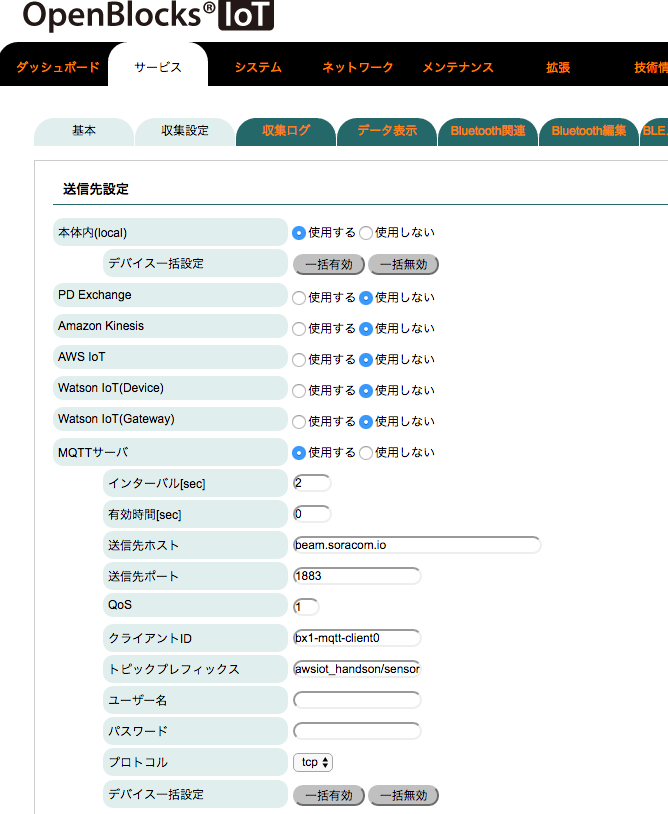

保存せず、引き続きページ下部へ移動します

収集設定 / センサデータの送信先設定
```````````````````````````````````

*dev_le_0000001* の **送信先設定** で **MQTT** にチェックを付けます

※ユニークID(MQTT) の項目が増え、クライアントID(AWS IoT)と同じ値が入ります

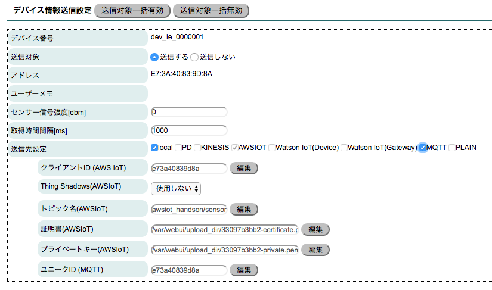

以上を確認したら保存してください。保存と同時に(若干のラグがありますが)送信が開始されます

Kibana上での確認
----------------

新規に *awsiot_handson_w_beam* というIndexに格納するようにしているので、そちらを参照するように変更するのをお忘れなく

まとめ
------

SORACOM Beamを使用することで、証明書ファイルをデバイス(BX1)に格納せずともAWS IoTへアクセスできるようになりました

デバイスへの設定が少なくて済むというのは、大量のデバイスを展開する際にもコスト面で有利です

あとかたづけ
------------

作成したリソースは削除しておきましょう

- SORACOM上

  #. SIMのグループを解除
  #. SIMグループを削除
  #. 認証ストアの削除

- AWS上

  #. Amazon Elasticsearchインスタンス
  #. AWS IoT モノ、証明書、ポリシー、ルール
  #. IAMロール

トラブルシュート
----------------

SORACOM Beamには転送されたデータが正しく転送されたか否かを確認する方法がありません (2016年5月現在)

そのため、うまく転送されていないと思われる場合は各種設定を見直すようにしてください

とくに見直すポイントは下記です

#. SORACOM: 証明書ストアへ保存した証明書や秘密鍵
#. AWS: AWS IoTのエンドポイント

転送がうまく作動していれば、あとはAWSのCloudWatchでログが確認できるので、処置可能です
