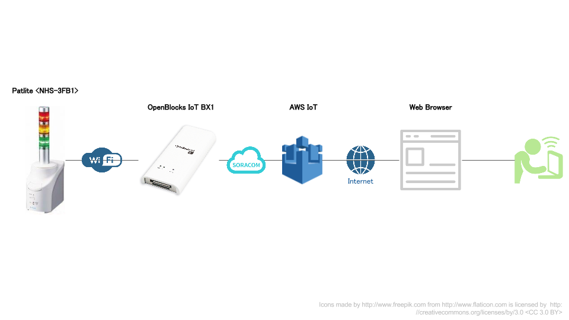

自習室: AWS IoTのThing Shadowでパトライトを制御する
===================================================

本章のゴール: **Thing Shadowの適用場面、構成コンポーネントやデータフローの理解**

本章は、最初にAWS IoTのThing Shadowのデモに触れてみることで全体像を確認し、その次に各コンポーネントの解説を行います

デモ
----

https://s3-ap-northeast-1.amazonaws.com/ma2shita/patlite_control_w_awsiot.html

※デモはセットアップが完了していないと機能しません。詳しくはハンズオンスタッフまで


デモ画面は左側に現在のパトライトの状態、右側にパトライトに対してのライトON/OFF制御を持っています

#. まずは右側のON/OFF制御を行ってみましょう
#. 気づいた事を話し合ってみましょう

TODO: 実際のデモと差し替える

.. raw:: html

  <iframe width="560" height="315" src="https://www.youtube.com/embed/Oyw2I6PMRJo" frameborder="0" allowfullscreen></iframe>

概要
----

システムの概要は下図の通りです



デモの画面は一番右の **Web Browser** になります

コンポーネントとデータフロー
----------------------------

概要の詳細化を行い、コンポーネントとデータフローを記載したのが下図です


- 通信の部

  - Patlite <NHS-3FB1> ←→ BX1 との通信は **SNMP**

    - 認証/認可: SNMPの機構を使用

  - BX1 ←→ AWS IOT との通信は **MQTTS**

    - 認証: AWS IoTが払いだしたX.509証明書を使用
    - 認可: X.509証明書に割り当てたAWS IoTのpolicyを使用

  - AWS IoT ←→ Web Browser との通信は **Websocket**

    - 認証: なし(CognitoのUnauth(=Anonymous)を使用)
    - 認可: Cognitoを使用しWeb Browserに一時的なIAMロールを割り当て、AWS IoT(のdataアクセス)に対して権限を付与

- プログラムの部

  - BX1に2つのプログラムを配置

    - `reporter.rb <https://gist.github.com/ma2shita/905a4d4a8a58377736154f79e769806f>`_

      - 定期的にPatliteのステータスを取得し、AWS IoTへ **reported** を送信する

    - `commander.rb <https://gist.github.com/ma2shita/197bc9b328bd21b20083dbc6fe14ff9b>`_

      - ``/update/delta`` を監視し、データが着信したら内容に応じてPatliteへコマンドを送信する

  - Web BrowserにJavascriptアプリケーションを実行させる

    - `patlite_control_w_awsiot.html <https://s3-ap-northeast-1.amazonaws.com/ma2shita/patlite_control_w_awsiot.html>`_ (`核となる部分を抽出したもの <https://gist.github.com/ma2shita/905971e4af2a0b9f73add70b75ee9fc3>`_)

      #. ``/update/documents`` を監視し、データの着信したら内容に応じて表示の更新をする
      #. Web Browserへの入力を基にAWS IoTへ **desired** を送信する

- データフローの部

  - 緑の線は、reporter.rbを起点に ``/update/documents`` を通じてWeb Browserの内容が更新されるまで
  - オレンジの線は、Web Browserへの入力を起点に ``/update/delta`` を通じてPatliteにコマンドが送信されるまで

システム設計のポイント
``````````````````````

双方向システムのポイントは、データフローがループ構成になるように設計するべきです

- ただし、無限ループを防止するためにもブレーカーを必ず設置しましょう。本デモでは人間をブレーカー代わりにしています
- ループ外からの操作にも対応できるようにするべきです

双方向が不要ならば緑の線もしくはオレンジの線の上のコンポーネントのみで十分です。しかしながら、その場合にThing Shadowを使う理由が見当たりません

- AWS IoTを **MQTTブローカー** として見るか **ステートマシン** として位置づけるか、これがThing Shadowを使う1つめの見極めポイントになります
- Thing Shadowの最大の特徴はデバイス操作の要求に対し **本当に操作すべき対象の抽出** を **``/update/delta`` への差分抽出** で実現/実装済みということです。この差分抽出は **現状(=reported)** と **要求(=desired)** という２つが必要となります。このような機構が不要であれば Thing Shadow を使用する必要はありません (e.g. センサーデータのアップロードにのみAWS IoTを使う場合)

commander.rbによる実行結果はreporter.rbに回収させるようにするのが、デバイスの稼働状況を確認するためにも推奨されます

プログラム改造のポイント
------------------------

Patliteを用意できない場合もありますので、その場合は reporter.rb や commander.rb を改造する必要が出てきます

改造ポイントはデバイス通信部になります

* `reporter.rb <https://gist.github.com/ma2shita/905a4d4a8a58377736154f79e769806f>`_ では **Flow: Fetch state from real-device** の部分
* `commander.rb <https://gist.github.com/ma2shita/197bc9b328bd21b20083dbc6fe14ff9b>`_ では **Flow: Execute command to real-device** の部分

<NHS-3FB1>は内部にステートを持ち、SNMP でステートの読み出しができる「ステートフル・デバイス」であったため、reporter.rbは *ポーリング・パターン※1* で実装しました

しかしRS-232CといったI/FなデバイスはデータがI/Fを通じて流れてくる「ストリーム・デバイス」であることが多いです。この場合は *リスニング・パターン※2* を実装する必要があります

- ※1 定期的にデータを取得しに行く定期実行型
- ※2 TCPソケットのようなポート待受型

参考資料
--------

- `AWS IoTのMQTT over WebSocketをCognito（Unauth）で認証して使ってみた ｜ Developers.IO <http://dev.classmethod.jp/cloud/aws/aws-iot-mqtt-over-websocket-cognito-identity-unatuh/>`_
- `Paho - Open Source messaging for M2M <https://www.eclipse.org/paho/clients/js/>`_
- `dwyl/learn-aws-iot: Learn how to use Amazon Web Services Internet of Things (IoT) service to build connected applications. <https://github.com/dwyl/learn-aws-iot>`_
- `Class: AWS.Credentials — AWS SDK for JavaScript <http://docs.aws.amazon.com/AWSJavaScriptSDK/latest/AWS/Credentials.html#get-property>`_
- `Device Shadow MQTT Topics - AWS IoT <http://docs.aws.amazon.com/ja_jp/iot/latest/developerguide/thing-shadow-mqtt.html#update-documents-pub-sub-topic>`_
- `テンプレートリテラルが実装された - JS.next <http://js-next.hatenablog.com/entry/2014/11/22/042055>`_
